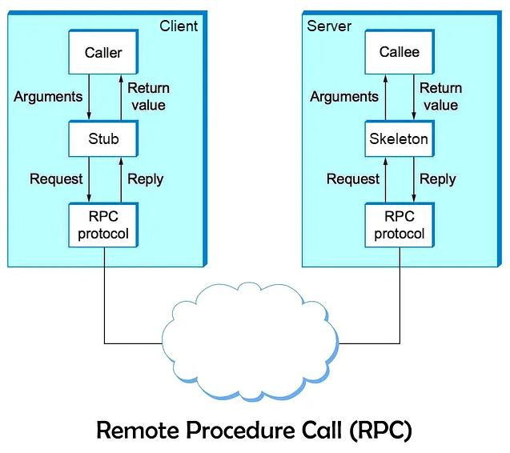

# Remote Procedure Call (RPC)

Remote Procedure Call (RPC) is a communication model used in distributed systems that allows a program to invoke a function running on a remote machine as if it were a local function call.

The key idea behind RPC is abstraction: the complexity of networking such as socket communication, packet serialization, transport protocols, and response handling is hidden from the application developer. As a result, developers can design distributed applications using familiar programming constructs while the RPC framework transparently manages the network communication.

In practice, RPC is widely used to connect services across machines, clusters, or datacenters. Instead of writing custom network protocols, developers define a set of callable functions on a server. Clients invoke these functions through the RPC system, which automatically packages the request, sends it across the network, executes the function on the remote server, and returns the result. This model is fundamental to many modern architectures, including microservices, cloud platforms, and network control systems.

## RPC Client–Server Architecture

RPC operates using a client–server architecture. In this model, the client is the program that requests a service, while the server is the program that provides and executes that service.

### Client

The client is the application that initiates the remote procedure call. From the client’s perspective, the remote function appears identical to a local function. The client simply calls the function with the required parameters and waits for the result. Behind the scenes, however, the call is intercepted by the RPC framework, which transforms the function call into a network request. The client does not directly interact with the network or the server implementation. This abstraction significantly simplifies application development and allows distributed systems to behave like a unified application.

### Server

The server hosts the actual implementation of the remote procedure. It listens for incoming RPC requests, processes them, executes the requested function, and returns the result back to the client. A server typically exposes a set of functions defined in an interface or service definition. These functions can perform operations such as retrieving data, executing business logic, or interacting with hardware or databases. The RPC server runtime manages the request handling, thread management, and response generation.

## Core Components of RPC

### Stub (Client Proxy)

The stub, sometimes called a client proxy, resides on the client side and acts as a local representation of the remote function. When the client calls a function, it is actually calling the stub. The stub’s primary responsibility is `marshalling`, which means converting the function parameters into a format suitable for network transmission. This process involves serializing the data structures into a standardized representation such as JSON, XML, or a binary format. The stub then forwards the encoded request to the RPC runtime, which sends it over the network.

### Skeleton (Server Stub)

The skeleton resides on the server side and performs the reverse operation of the client stub. When a request arrives from the network, the skeleton receives the serialized data and performs `unmarshalling`, which converts the transmitted data back into the original data types expected by the server function. After reconstructing the parameters, the skeleton invokes the appropriate server function with those parameters. Once the function completes execution, the result is serialized again and returned to the client through the same RPC mechanism.

### Transport Protocol

The transport protocol is responsible for delivering RPC messages across the network. It provides the communication channel between the client and server. Different RPC frameworks use different transport mechanisms depending on their design goals. Some frameworks rely on traditional protocols such as TCP or HTTP, while modern systems may use HTTP/2 or persistent connections to improve performance and reduce latency. The transport layer ensures reliable delivery of messages and handles connection management.

### Data Format

The data format defines how the RPC request and response messages are serialized before transmission. Serialization formats vary in complexity and efficiency. Text-based formats such as JSON and XML are human-readable and easy to debug but can be larger and slower to parse. Binary formats such as Protocol Buffers are compact and highly efficient, making them more suitable for high-performance distributed systems. The choice of serialization format directly impacts performance, interoperability, and ease of debugging.

## RPC Workflow

- **Initiation**: The RPC interaction begins when the client application invokes a function that is defined as a remote procedure. From the perspective of the application code, this call appears identical to calling a normal local function. However, instead of executing immediately within the same process, the call is intercepted by the RPC framework, which prepares the request for remote execution.

- **Marshalling**: Once the call is intercepted, the client stub converts the function arguments into a serialized message format. This process, known as marshalling, transforms structured data into a format that can be transmitted across the network. Marshalling ensures that complex data types such as objects, arrays, or structures can be reconstructed accurately on the receiving side.

- **Transmission**: After serialization, the RPC runtime sends the message to the server using the chosen transport protocol. The request travels across the network just like any other data packet, typically over TCP-based protocols such as HTTP or HTTP/2. The RPC framework ensures that the message is correctly routed to the appropriate server endpoint.

- **Reception**: When the message reaches the server, the server-side RPC runtime receives the request and forwards it to the skeleton associated with the requested procedure. At this stage, the RPC framework determines which server function should handle the request based on the service definition and method name contained in the message.

- **Unmarshalling**: The skeleton then performs unmarshalling, which converts the serialized request data back into the original parameter types expected by the server function. This step reconstructs the input parameters exactly as they were provided by the client.

- **Execution**: After the parameters are reconstructed, the skeleton invokes the corresponding server-side function. The function executes its logic, which may involve processing data, querying databases, performing calculations, or interacting with external systems. Once execution is complete, the function produces a result that must be returned to the client.

- **Return Path**: The result is serialized by the server skeleton and sent back through the RPC runtime over the network. When the response reaches the client, the client stub performs the final unmarshalling step and converts the response back into the appropriate data types. The stub then returns the result to the client application, completing the illusion that the remote procedure call was a local function call.

## Evolution of RPC Frameworks

Over time, RPC technologies have evolved significantly to address changing computing environments and performance requirements. Early RPC systems were designed for enterprise distributed object systems, while modern implementations are optimized for cloud-native microservices.

| Feature           | CORBA                          | XML-RPC            | SOAP-RPC                | JSON-RPC                  | gRPC                          |
| ----------------- | ------------------------------ | ------------------ | ----------------------- | ------------------------- | ----------------------------- |
| **Era**           | Early 1990s (Legacy)           | Late 1990s         | Early 2000s             | Mid 2000s                 | Modern (2015+)                |
| **Data Format**   | Binary (CDR)                   | XML                | XML (Envelope)          | JSON                      | Protocol Buffers              |
| **Transport**     | IIOP (over TCP)                | HTTP               | HTTP, SMTP, JMS         | HTTP, TCP, WebSockets     | HTTP/2                        |
| **Typing**        | Strongly Typed                 | Weakly Typed       | Strongly Typed          | Weakly Typed              | Strongly Typed                |
| **Efficiency**    | Medium (Complex)               | Low (Verbose)      | Low (High Overhead)     | Medium / High             | Very High (Binary)            |
| **Streaming**     | No                             | No                 | No                      | No                        | Bi-directional                |
| **Async Support** | Yes                            | Limited            | No                      | Via WebSockets            | Native                        |
| **Security**      | Kerberos, SSL                  | Basic TLS/SSL      | WS-Security             | Basic TLS/SSL             | TLS + Interceptors            |
| **Ease of Use**   | Complex                        | Simple             | Complex                 | Simple                    | Medium (Requires IDL / Proto) |
| **Primary Use**   | Enterprise Distributed Objects | Early Web Services | Enterprise Web Services | Lightweight APIs / Mobile | Microservices / Cloud         |

### Legacy Enterprise RPC (`CORBA` and `SOAP`)

**CORBA** (Common Object Request Broker Architecture) emerged in the early 1990s as one of the first attempts to enable interoperability between applications written in different programming languages. CORBA allowed objects written in languages such as C++ and Java to communicate across distributed environments using an object broker architecture. Although it provided strong typing and powerful capabilities, its complexity and heavy configuration requirements made it difficult to maintain.

**SOAP-RPC** appeared later as part of the early web services ecosystem. SOAP uses XML-based message envelopes to define requests and responses and includes extensive standards for security, transactions, and reliability. While SOAP became widely used in enterprise systems, the verbosity of XML messages introduced performance overhead, which limited its efficiency in high-throughput environments.

### Lightweight Web RPC (`XML-RPC` and `JSON-RPC`)

As web applications became more common, simpler RPC protocols emerged.

**XML-RPC** was one of the earliest lightweight approaches, using XML over HTTP to encode remote calls. It was easier to implement than CORBA or SOAP but still inherited XML’s verbosity and parsing overhead.

**JSON-RPC** later replaced XML with JSON, providing a much lighter and faster serialization format. JSON-RPC simplified the implementation of remote calls for web applications and mobile clients. Its simplicity made it popular for APIs that required straightforward request-response interactions without complex enterprise features.

### Modern High-Performance RPC (`gRPC`)

Modern distributed systems require significantly higher performance, scalability, and efficiency.

**gRPC**, introduced by Google in 2015, addresses these requirements by combining Protocol Buffers (a compact binary serialization format) with HTTP/2 as the transport layer. This design enables features such as bi-directional streaming, multiplexed connections, and efficient binary encoding, which dramatically improve performance compared to earlier RPC systems. gRPC also provides strong typing through service definitions written in `.proto` files, enabling automatic generation of client and server code in multiple programming languages.

Because of its efficiency and scalability, gRPC has become a widely adopted technology in microservices architectures, cloud-native platforms, and high-performance distributed systems. We will cover gRPC in a separate document.

## Typing in RPC

Typing in RPC refers to how strictly an RPC system defines and validates the data types exchanged between a client and a server. When a remote procedure is invoked, the parameters and return values must be serialized into a message format and transmitted across the network. The RPC framework must therefore determine how those values are structured, validated, and reconstructed on the receiving side. The level of type enforcement directly affects reliability, interoperability, and developer experience.

In **strongly typed** RPC systems, the structure and data types of requests and responses are explicitly defined in advance using an interface definition or schema. Both the client and server generate code based on this definition, ensuring that parameters match the expected types before a request is transmitted. If the types do not match the defined schema, the request typically fails before reaching the server. This approach improves reliability, prevents many runtime errors, and enables features such as automatic code generation and compile-time validation. Frameworks such as CORBA, SOAP-RPC, and gRPC follow this model by requiring formal interface definitions (for example, IDL files or Protocol Buffer schemas).

In contrast, **weakly typed** RPC systems allow more flexibility in the data that can be transmitted between client and server. These systems typically use dynamic serialization formats such as JSON or XML without enforcing strict schemas at the protocol level. As a result, clients can send parameters of different types without immediate validation, and the server must perform its own type checking when processing the request. While this approach simplifies implementation and improves interoperability across loosely coupled systems, it can introduce runtime errors if unexpected data types are received. Protocols such as XML-RPC and JSON-RPC follow this model, relying on the application logic rather than the protocol itself to enforce type correctness.
