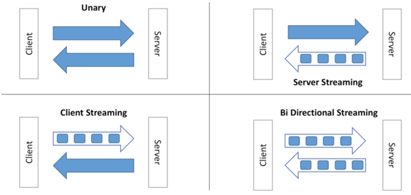
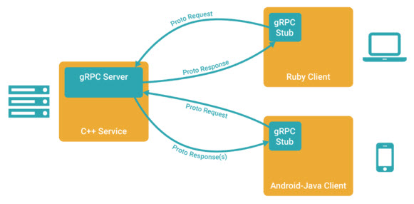
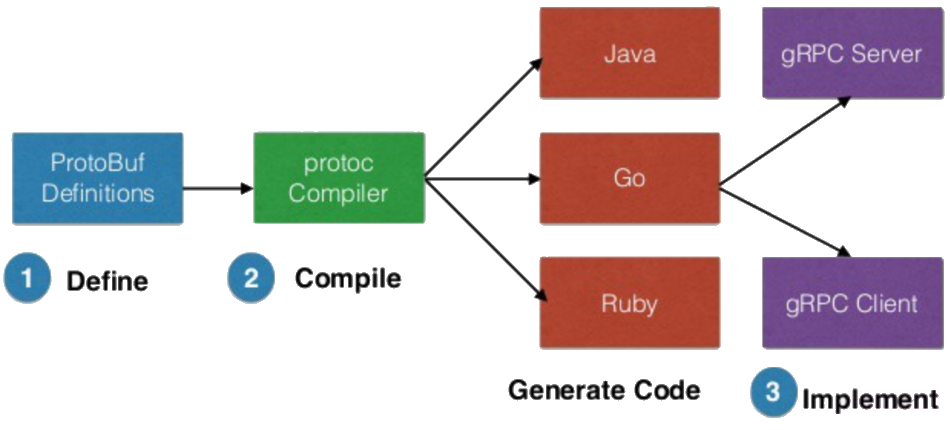
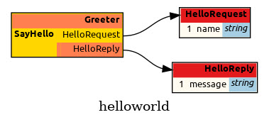

# gRPC (Google Remote Procedure Call)

gRPC is a modern, high-performance Remote Procedure Call (RPC) framework. It was originally developed internally at Google and released as an open-source project in 2015. Today, it is maintained as a Cloud Native Computing Foundation (CNCF) project, with contributions from Google and a large open-source community. Because of its performance, strong typing, and cross-language support, gRPC has become a common choice for communication between services in microservice architectures, distributed systems, and large-scale cloud platforms.

## gRPC Key Principles

| Feature                  | Description                                                                                                          |
| ------------------------ | -------------------------------------------------------------------------------------------------------------------- |
| **Communication Models** | Supports unary, server streaming, client streaming, and bidirectional streaming RPC models.                          |
| **Data Format**          | Uses Protocol Buffers (binary), providing compact encoding, strong typing, and schema enforcement.                   |
| **Transport Protocol**   | HTTP/2                                                                                                               |
| **Connection Handling**  | Uses persistent HTTP/2 connections, reducing connection setup and handshake overhead.                                |
| **Performance**          | High throughput and low latency due to binary serialization and HTTP/2 multiplexing.                                 |
| **Stateful / Stateless** | Flexible architecture; can maintain state during long-lived streams or operate in a stateless request-response mode. |
| **Language Support**     | Broad ecosystem including Python, Go, Java, C++, C#, Node.js, Ruby, and others.                                      |
| **Load Balancing**       | Supports client-side load balancing and integration with external proxies such as Envoy or service meshes.           |

### Communication Models

gRPC supports multiple communication patterns that go beyond the traditional request-response model used in most HTTP APIs. The simplest form is unary RPC, where the client sends a single request and receives a single response from the server. This model behaves similarly to a normal function call and is commonly used for operations such as authentication requests or database queries.

In addition to unary calls, gRPC also supports streaming communication models. In server streaming, the client sends one request and the server returns a sequence of responses over time, which is useful for scenarios such as real-time market data or event feeds. In client streaming, the client sends multiple messages to the server and receives a single response when the stream completes, which is often used for uploading large datasets or logs. The most flexible model is bidirectional streaming, where both client and server can send messages independently over the same connection, enabling real-time interactions such as chat systems or live telemetry streams.



### Data Format

gRPC uses Protocol Buffers (Protobuf) as its default data serialization format. Protocol Buffers are a compact, binary encoding format that allows structured data to be efficiently serialized and transmitted between systems. Unlike text-based formats such as JSON or XML, binary serialization produces much smaller messages and requires less CPU overhead for encoding and decoding.

Another major advantage of Protocol Buffers is strong type enforcement. Data structures and service interfaces are defined in `.proto` files, which act as a contract between the client and server. These definitions specify message fields, data types, and service methods, ensuring that both sides of the communication interpret the data consistently. This contract-based design improves reliability and enables automatic code generation for multiple programming languages.

> Refer to the [Protocol Buffers guide](./03_README_proto.md) for more information.

### Transport Protocol

gRPC operates exclusively on HTTP/2, which provides several features that significantly improve performance compared to HTTP/1.1. HTTP/2 introduces multiplexed streams, allowing multiple requests and responses to share a single TCP connection simultaneously without blocking each other. This eliminates the need to open separate connections for each request and reduces latency.

HTTP/2 also supports header compression (HPACK) and binary framing, which further improves network efficiency. These capabilities allow gRPC to handle a large number of concurrent service calls while maintaining low overhead, making it well suited for modern distributed applications where services frequently communicate with each other.

### Connection Handling

Because gRPC runs on HTTP/2, it benefits from persistent connections. Instead of creating a new connection for every request, a single connection can remain open for a long time and handle multiple RPC calls. This persistent connection model reduces the overhead associated with connection setup, TLS negotiation, and handshake operations.

Persistent connections also enable efficient streaming communication, where a client and server can exchange a sequence of messages over a single connection. This capability is particularly valuable for systems that require continuous data exchange, such as monitoring systems, telemetry pipelines, and real-time messaging applications.

### Performance

gRPC is designed for high throughput and low latency. Two primary factors contribute to its performance advantages: the use of binary serialization (Protocol Buffers) and the efficient networking capabilities of HTTP/2. Binary serialization reduces message size and parsing overhead, while HTTP/2 multiplexing allows many requests to share a single connection without blocking. Together, these features significantly reduce network overhead compared to traditional REST APIs that rely on JSON over HTTP/1.1. As a result, gRPC is often preferred in high-performance environments where services exchange large volumes of data or require rapid request handling.

### Stateful and Stateless Operation

Although REST APIs are typically designed to be stateless, gRPC provides flexibility to operate in both stateless and stateful modes. For unary RPC calls, gRPC behaves similarly to stateless HTTP APIs where each request is independent. However, when streaming is used, a connection can remain active for an extended period, allowing the client and server to exchange multiple messages within the same session. This capability allows gRPC applications to maintain contextual state across messages while still benefiting from efficient network communication.

### Language Support

One of the strengths of gRPC is its language-agnostic design. The Protocol Buffers service definition can be compiled into client and server code for many programming languages, including Python, Go, Java, C++, C#, Node.js, Ruby, and others. This allows services written in different languages to communicate using the same RPC interface definition. Because of this broad language support, gRPC is widely used in heterogeneous environments where different services may be implemented using different technology stacks. The shared `.proto` definitions ensure consistent communication regardless of the programming language used by each service.



## The gRPC Workflow

The development lifecycle of a gRPC application follows a contract-first approach, meaning that the service interface is defined before writing the client or server implementation. This process ensures that both sides of the communication adhere to the same service definition and data structures.



### Define (Protocol Buffer Definitions)

The process begins by defining the service interface and message structures in a `.proto` file using the Protocol Buffers language. This file specifies the available RPC methods, the request and response message structures, and the data types associated with each field. In essence, the `.proto` file acts as a formal contract that describes how the client and server communicate. By establishing this interface definition upfront, developers ensure that all components in the system adhere to the same communication structure.

### Compile (Using the `protoc` Compiler)

Once the `.proto` file is defined, the Protocol Buffer compiler (`protoc`) is used to generate language-specific code from the service definition. The generated artifacts typically include message classes for request and response types, along with client and server interfaces that handle RPC communication. This automated generation eliminates the need for developers to manually implement serialization logic or network communication layers.

### Implement (Client and Server)

After the code generation step, developers implement the actual application logic using the generated interfaces.

- On the server side, the service methods defined in the `.proto` file are implemented to perform the required operations when RPC requests are received. The server application runs a gRPC service that listens for incoming client calls and processes them accordingly.

- On the client side, a generated stub acts as a proxy for the remote service. The client establishes a connection to the server and invokes methods through this stub as if they were local function calls.

The gRPC framework transparently handles serialization, network communication, request routing, and response delivery, allowing developers to focus on application logic rather than low-level networking details.

## Example Execution Flow

Let us go over a simple gRPC example. Project structure looks like the following:

```text
grpc_project
├── helloworld.proto
├── client
│   ├── client.py
│   └── proto/
└── server
    ├── server.py
    └── proto/
```

Create a `helloworld.proto` file to define service methods and message structures.

```protobuf
syntax = "proto3";

package helloworld;

// The greeting service definition.
service Greeter {
  // Sends a greeting
  rpc SayHello (HelloRequest) returns (HelloReply) {}
}

// The request message containing the user's name
message HelloRequest { string name = 1; }

// The response message containing the greetings
message HelloReply { string message = 1; }
```

You can visualize the proto file using [protodot](https://github.com/seamia/protodot) Golang utility.



The server implements the `GreeterServicer`. It listens on a specific port (e.g., 50051) and uses a thread pool to handle concurrent calls.

```python
# server/server.py

import os
import sys
import grpc
from concurrent import futures

# Add the 'proto' directory to the Python path
sys.path.append(os.path.abspath('./proto'))

import helloworld_pb2
import helloworld_pb2_grpc


class GreeterServicer(helloworld_pb2_grpc.GreeterServicer):

    def SayHello(self, request, context):
        return helloworld_pb2.HelloReply(message=f'Hello, {request.name}')


def serve():

    server = grpc.server(futures.ThreadPoolExecutor(max_workers=10))
    helloworld_pb2_grpc.add_GreeterServicer_to_server(GreeterServicer(), server)

    server.add_insecure_port('[::]:50051')
    server.start()
    print("gRPC Server running on port 50051...")
    server.wait_for_termination()


if __name__ == '__main__':

    serve()
```

The client opens an insecure channel to the server's IP/Port, initializes the `GreeterStub`, and invokes the method as if it were a local Python function.

```python
# client/client.py

import os
import sys
import grpc

# Add the 'proto' directory to the Python path
sys.path.append(os.path.abspath('./proto'))

import helloworld_pb2
import helloworld_pb2_grpc

def run():

    with grpc.insecure_channel('localhost:50051') as channel:   # Connect to the server
        stub = helloworld_pb2_grpc.GreeterStub(channel)  # Create a stub
        response = stub.SayHello(helloworld_pb2.HelloRequest(name='world'))  # Make a request
        print("Greeter client received: " + response.message)


if __name__ == '__main__':

    run()
```

Ensure you have gRPC and the gRPC tools for Python installed:

    pip3 install grpcio grpcio-tools

Change to the gRPC project directory:

    cd grpc_project

The Protocol Buffer Compiler (`protoc`) is used to generate language-specific code from the `.proto` file.

Invoke the following:

    python3 -m grpc_tools.protoc -I. --python_out=. --grpc_python_out=. helloworld.proto

This is going to generate **helloworld_pb2.py** and **helloworld_pb2_grpc.py** files.

Copy both files into `client/proto` and `server/proto`.

Breakdown of flags:

- `--python_out=`

    Generates **message classes** from the `.proto` file.

    These classes define the request and response data structures used in gRPC communication.

    The generated file typically follows this naming convention: `<proto_filename>_pb2.py`.

- `--grpc_python_out=`

    Generates the **service stub** for gRPC communication.

    This file contains server and client stubs that allow remote procedure calls.

    The generated file typically follows this naming convention: `<proto_filename>_pb2_grpc.py`.

Run the gRPC server in a terminal:

    python3 server.py

In another terminal, invoke the gRPC client:

    python3 client.py

You should be able to see this output:

    Greeter client received: Hello, world

## gRPC Service Definition

In gRPC, a service definition specifies the set of remote procedures that a server exposes to clients. These services are defined in the same `.proto` file, which acts as the formal contract between the client and server. The service definition describes the available RPC methods along with the message types used for their inputs and outputs. Because the contract is defined in a language-neutral format, code generation tools can automatically create compatible client and server interfaces in multiple programming languages.

Once the service definition is compiled using the Protocol Buffer compiler, developers implement the server-side logic for the declared methods. A gRPC server then hosts the service and listens for incoming client requests, typically over HTTP/2. Clients interact with the service through generated stubs that allow remote methods to be invoked as if they were local function calls.

gRPC supports multiple [communication models](#communication-models): unary, server streaming, client streaming, and bidirectional streaming.

### Unary RPC

In a unary RPC, the client sends a single request to the server and receives a single response. This interaction model closely resembles a traditional function call and is the most common RPC pattern used in service APIs.

```protobuf
service ExampleService {
    rpc SayHello (HelloRequest) returns (HelloResponse);
}
```

In this example, `ExampleService` defines a method named `SayHello`. The client sends a `HelloRequest` message, and the server responds with a `HelloResponse` message.

### Server Streaming RPC

In server streaming, the client sends one request, and the server returns a sequence of responses over time. This pattern is useful when a single request results in multiple pieces of data, such as retrieving a large dataset or receiving live updates.

```protobuf
service ExampleService {
    rpc GetNumbers (NumberRequest) returns (stream NumberResponse);
}
```

Here, the server continuously sends multiple `NumberResponse` messages in response to a single `NumberRequest`.

### Client Streaming RPC

In client streaming, the client sends a stream of messages to the server, and the server processes them before returning a single response. This model is useful when large amounts of data need to be transmitted incrementally, such as uploading data or processing batched inputs.

```protobuf
service ExampleService {
    rpc ComputeSum (stream SumRequest) returns (SumResponse);
}
```

The client sends multiple `SumRequest` messages, and after receiving the complete stream, the server returns a single `SumResponse`.

### Bidirectional Streaming RPC

In bidirectional streaming, both the client and the server send streams of messages independently over the same connection. Neither side needs to wait for the other to finish sending messages, enabling fully asynchronous communication.

```protobuf
service ExampleService {
    rpc Chat (stream ChatMessage) returns (stream ChatMessage);
}
```

This interaction model is commonly used for real-time communication scenarios such as messaging systems, collaborative applications, and continuous data streams.

## Additional gRPC Capabilities

The previous sections covered the core concepts and primary mechanisms that make gRPC a powerful RPC framework, including its communication models, serialization format, transport protocol, and development workflow. However, gRPC provides many additional capabilities that support production-grade distributed systems. These features help address concerns such as security, reliability, scalability, and operational visibility. The following topics briefly highlight some of the other important components of the gRPC ecosystem.

- **Metadata** (Headers and Trailers)

    Allows additional contextual information, such as authentication tokens or request identifiers, to be transmitted alongside RPC calls.

- **Authentication and Security**

    Provides mechanisms such as TLS and token-based authentication to secure communication between clients and servers.

- **Deadlines and Timeouts**

    Enables clients to specify maximum waiting times for RPC calls, preventing requests from blocking indefinitely.

- **Error Handling and Status Codes**

    Uses standardized status codes to communicate the outcome of RPC calls and provide structured error reporting.

- **Interceptors** (Middleware)

    Allows custom logic such as logging, authentication, or tracing to intercept RPC calls before or after execution.

- **Service Discovery**

    Enables clients to dynamically locate available service instances in distributed environments.

- **Load Balancing**

    Distributes requests across multiple server instances to improve scalability and reliability.
