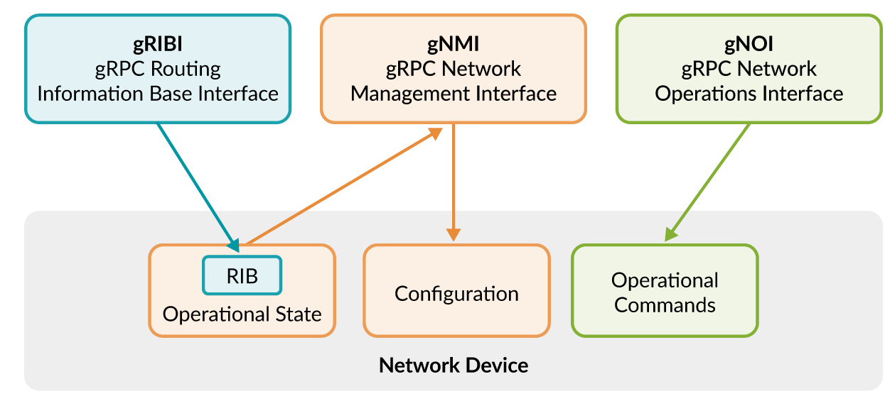

# The gRPC Networking Suite

gRPC itself is a general-purpose Remote Procedure Call (RPC) framework. It provides a mechanism for defining services, exchanging structured messages, and invoking functions on remote systems. Developers define their own message formats and service interfaces using Protocol Buffers (`.proto` files), and the gRPC framework handles serialization, transport (HTTP/2), and communication between clients and servers.

Because gRPC is generic, it does not impose any domain-specific semantics on the data being exchanged. A developer can define any service, message structure, or API needed by an application. This flexibility makes gRPC widely used across many domains, including microservices, distributed systems, storage systems, and networking platforms.

In networking, however, vendors and industry groups recognized the need for standardized APIs so that controllers, automation systems, and network devices could interoperate. Instead of each vendor defining its own gRPC API, several standardized protocols were created on top of gRPC. These protocols define common message schemas and service behaviors for specific networking tasks such as configuration management, operational actions, routing control, and programmable packet processing.

| Protocol      | Full Name                               |
| ------------- | --------------------------------------- |
| **gNMI**      | gRPC Network Management Interface       |
| **gNOI**      | gRPC Network Operations Interface       |
| **gRIBI**     | gRPC Routing Information Base Interface |
| **P4Runtime** | P4 Runtime                              |

These protocols are not replacements for gRPC. Instead, they are standardized APIs built on top of gRPC, defining specific services and message formats that network devices and controllers can implement consistently.

### `gNMI` (gRPC Network Management Interface)

gNMI is a standardized API for network configuration management and telemetry retrieval. It allows external systems such as network controllers, monitoring platforms, or automation tools to interact with network devices using a consistent interface. The protocol defines how configuration data and operational state information can be retrieved, modified, or monitored remotely.

gNMI typically relies on YANG data models to define the structure of configuration and state data. Instead of using traditional command-line interfaces (CLI) or vendor-specific APIs, network operators can programmatically access device configuration using structured data models. This improves automation, consistency, and interoperability across different vendors and platforms.

Another important feature of gNMI is streaming telemetry. Rather than repeatedly polling devices for status information, a controller can subscribe to specific data paths and receive continuous updates whenever values change. This subscription model greatly improves scalability and efficiency in large networks, particularly in modern data center environments where thousands of devices must be monitored in real time.

### `gNOI` (gRPC Network Operations Interface)

gNOI focuses on operational tasks rather than configuration management. While gNMI is used for persistent configuration and telemetry, gNOI provides a standardized way to perform administrative and operational actions on network devices.

Examples of gNOI operations include rebooting a device, rotating security certificates, performing network diagnostics (such as ping or traceroute), managing files, or retrieving system health information. These tasks are typically executed as one-time commands rather than persistent configuration changes.

By exposing these operations through a structured gRPC API, gNOI allows automation systems to perform operational maintenance tasks in a consistent and programmatic way. This eliminates the need for manual CLI interaction and enables large-scale network management platforms to automate troubleshooting and system maintenance across multiple devices.

### `gRIBI` (gRPC Routing Information Base Interface)

gRIBI provides a mechanism for external controllers to program the routing tables of a network device directly. Specifically, it allows controllers to insert, update, or remove entries in the device’s Routing Information Base (RIB).

Traditional routing protocols such as BGP or OSPF operate in a distributed manner where routers exchange routing information and independently compute forwarding decisions. gRIBI introduces a more centralized model where a controller can influence routing behavior directly. By installing routes in the RIB, the controller can determine how traffic should be forwarded through the network.

This approach is particularly useful in software-defined networking (SDN) architectures. Controllers can dynamically steer traffic, implement traffic engineering policies, or perform fast failover by updating routing entries without waiting for routing protocols to converge. As a result, gRIBI enables more deterministic and programmable traffic control within modern network infrastructures.

### P4Runtime

P4Runtime is a control-plane API used to manage the packet-processing behavior of programmable network devices that support the P4 programming language. While protocols such as gNMI and gRIBI operate at the level of configuration and routing, P4Runtime interacts directly with the data-plane pipeline inside programmable switches.

The P4 language allows developers to define how packets are parsed, matched, and processed within a switch or network device. Once a P4 program defines the packet-processing pipeline, P4Runtime enables an external controller to populate tables, update match-action rules, and control forwarding behavior dynamically.

This architecture enables highly flexible networking systems where packet-processing logic can be customized without modifying hardware. Network operators can implement new protocols, deploy custom forwarding policies, or adapt packet processing to specialized workloads. As a result, P4Runtime plays an important role in programmable networking environments and advanced data center architectures.
