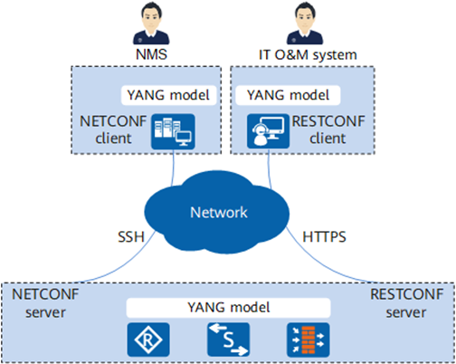
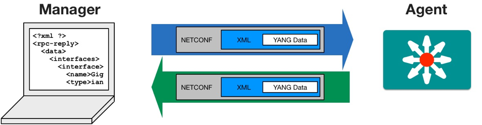

## YANG and Network Management Protocols

A common misconception is that YANG is a network protocol. In reality, YANG is only a data modeling language. It defines the structure of configuration and operational data, but it does not define how that data is transmitted. Instead, several protocols use YANG-defined models to exchange data between systems.

| Feature       | NETCONF                         | RESTCONF                    | gNMI                                  |
| ------------- | ------------------------------- | --------------------------- | ------------------------------------- |
| Transport     | SSH                             | HTTP/HTTPS                  | HTTP/2 (gRPC)                         |
| Data Encoding | XML                             | XML or JSON                 | JSON or Protobuf                      |
| Typical Use   | Device configuration management | REST-based automation tools | Streaming telemetry and configuration |

In this architecture:

- YANG defines the schema (the data model).
- NETCONF, RESTCONF, and gNMI transport the data between systems.



**NETCONF** was the first protocol designed to work closely with YANG, providing a reliable and transactional mechanism for configuring network devices using XML-encoded remote procedure calls over SSH. Later, **RESTCONF** was introduced to make YANG-based management easier to integrate with web technologies by exposing YANG data models through RESTful HTTP APIs that support both XML and JSON. More recently, **gNMI** was developed for large-scale data center environments, using gRPC and Protocol Buffers to deliver high-performance configuration management and streaming telemetry based on YANG-modeled data.

```text
CLI / Screen Scraping
        ↓
SNMP + MIB
        ↓
YANG Data Models
        ↓
NETCONF / RESTCONF / gNMI
```

### NETCONF (Network Configuration Protocol)

NETCONF is a network management protocol designed specifically for configuring and managing network devices such as routers and switches. It was standardized by the IETF to replace older management approaches that relied on command-line interfaces (CLI) or SNMP-based configuration. Prior to NETCONF, automation systems often had to parse CLI output, which was fragile and vendor-specific. NETCONF introduced a structured, programmatic interface that allows configuration changes to be performed in a reliable and standardized way.

NETCONF operates over a persistent SSH connection between the client (such as a network automation tool) and the network device. Communication occurs using XML-encoded Remote Procedure Calls (RPCs). The structure of configuration and operational data is defined using YANG data models, which specify the schema and validation rules for the data exchanged between the client and the device. In this model-driven architecture, YANG defines the structure of the data, while NETCONF provides the protocol used to transport and manipulate that data.



One of the strongest capabilities of NETCONF is its support for **transactional** configuration management. Devices maintain configuration datastores such as running, candidate, and startup. Administrators can lock a configuration datastore to prevent concurrent modifications, apply configuration changes to the candidate datastore, validate those changes against the YANG model, and then commit them atomically. If a configuration fails validation or produces unexpected results, the changes can be rolled back. These features make NETCONF particularly well suited for large enterprise networks where configuration consistency and safety are critical.

The main limitation of NETCONF is its reliance on XML encoding, which tends to be verbose and computationally expensive to parse. Processing large XML payloads can place additional overhead on both the client and the network device, especially in environments with large configuration datasets or high-frequency management operations.

### RESTCONF

RESTCONF is a network management protocol that provides a simpler and more web-friendly interface for interacting with YANG-based data models. It was introduced to make network automation easier for developers who were already familiar with modern web technologies and RESTful APIs. RESTCONF uses the same YANG data models as NETCONF but exposes them through standard HTTP-based interfaces.

In RESTCONF, the hierarchical structure defined in a YANG model is mapped directly to HTTP Uniform Resource Identifiers (URIs). Clients interact with network devices using standard HTTP methods such as `GET` to retrieve data, `POST` to create resources, `PUT` or `PATCH` to modify existing data, and `DELETE` to remove configuration elements. RESTCONF supports both XML and JSON encodings, with JSON being commonly used because it integrates well with modern programming languages and web frameworks.

The primary advantage of RESTCONF is its ease of integration. Because it relies on widely used web protocols and data formats, developers can interact with network devices using common tools such as HTTP libraries, REST clients, or web frameworks. This makes RESTCONF especially useful for integrating network management functions into web applications, dashboards, or lightweight automation scripts.

However, RESTCONF operates using stateless HTTP connections, which means each request is handled independently. Unlike NETCONF, it does not provide the same robust transactional mechanisms, such as datastore locking and coordinated configuration commits. Additionally, repeated HTTP requests may introduce overhead compared to protocols that maintain long-lived connections.

### gNMI

Refer to [gNMI guide](./08_README_gnmi.md) for more details.
