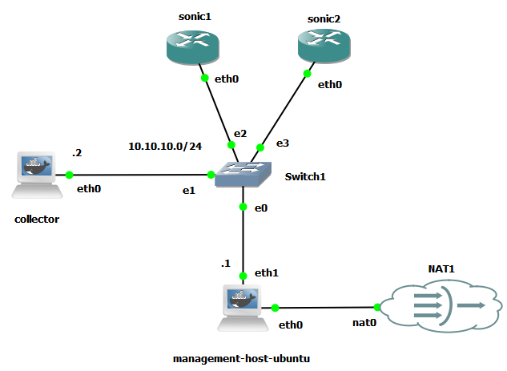

# Sonic Telemetry

The objective of this project is to establish a structured framework for collecting, streaming, and analyzing telemetry data from network switches running the SONiC operating system.

Traditional network monitoring systems relied heavily on **poll-based** protocols such as SNMP. In those systems, a monitoring server periodically queries devices at fixed intervals to retrieve counters or operational state. While this approach works for basic monitoring, it introduces significant limitations. Polling intervals are typically measured in seconds or minutes, which can hide short-lived events such as micro-bursts, transient packet drops, or rapid control-plane changes.

Modern network telemetry addresses these limitations by adopting a **push-based** streaming model. Instead of repeatedly polling the device, the switch continuously streams structured operational data to a collector in near real time. This allows operators and monitoring systems to observe network behavior at much higher resolution and react more quickly to abnormal conditions.

The telemetry data collected from SONiC switches can include several categories of operational information:

- **Hardware Health**: CPU utilization, memory usage, fan speeds, power supply status, and temperature sensors. These metrics help detect hardware degradation, cooling failures, or resource exhaustion before they impact system stability.

- **Interface Statistics**: Detailed counters for received and transmitted traffic, including octets, packets, errors, and drops. Optical transceiver diagnostics (DOM) such as temperature, voltage, and laser power are also commonly included.

- **Protocol State**: Control-plane information such as BGP neighbor sessions, MAC address learning events, routing updates, and other protocol-level state changes.

- **Dataplane Metrics**: Low-level hardware indicators such as buffer queue occupancy, congestion signals, and watermarks that provide insight into how traffic is handled inside the switch ASIC.

Together, these telemetry streams provide a comprehensive and high-resolution view of both the control plane and the data plane of the network.

## Why Telemetry Matters

Continuous telemetry collection has become a fundamental capability in modern data center networks, particularly in hyperscale and large enterprise environments. Instead of relying on occasional snapshots of device state, operators can observe the network continuously and correlate events across thousands of devices.

- **Real-Time Observability**: Streaming telemetry provides sub-second visibility into the operational state of the network. Because data is pushed directly from the device to collectors, monitoring systems can observe link utilization, queue behavior, and protocol state changes as they occur. This level of observability eliminates many of the blind spots that occur when devices are only polled at long intervals.

- **Proactive Fault Detection**: High-resolution telemetry enables operators to detect subtle problems before they escalate into outages. Examples include degrading optical transceivers, silent packet drops caused by congestion, unstable routing sessions, or abnormal hardware sensor readings. By detecting these conditions early, operators can intervene before application traffic is impacted.

- **Capacity Planning**: Telemetry data collected over long periods provides valuable insight into traffic growth and infrastructure utilization. By analyzing trends in link utilization, CPU consumption, and memory usage, network engineers can make informed decisions about when to upgrade hardware, increase link capacity, or rebalance workloads across the network.

- **AI-Driven Analytics and Automation**: Because streaming telemetry produces structured, machine-readable data, it can be integrated directly into analytics platforms, automation pipelines, and machine learning systems. These systems can detect anomalies, identify patterns, and automatically trigger remediation workflows. This approach enables closed-loop automation, where the network can automatically respond to detected issues without manual intervention.

## The Technology Stack: gNMI

SONiC supports modern telemetry collection through `gNMI` (gRPC Network Management Interface), a protocol developed as part of the OpenConfig ecosystem.

gNMI is designed to provide a unified interface for retrieving operational state, managing configuration, and subscribing to streaming telemetry updates. It is built on top of `gRPC`, which itself uses HTTP/2 as its transport layer. This architecture enables efficient, persistent connections between the network device and telemetry collectors, allowing high-frequency data streaming without the overhead associated with traditional polling mechanisms.

One of the key advantages of gNMI is its use of structured data models defined using `YANG`. These models describe the structure and semantics of network configuration and state in a vendor-neutral way. OpenConfig provides a set of widely adopted YANG models that define common network constructs such as interfaces, routing protocols, optical modules, and system resources.

By combining gRPC, Protocol Buffers, and YANG-based data models, gNMI enables scalable, programmatic access to network state and telemetry data. This makes it well suited for modern data center environments where thousands of devices must be monitored and managed through automated systems.

## Documentation and Learning Path

Because the technologies involved in modern telemetry such as RPC frameworks, serialization formats, and data modeling can be complex, this project includes a structured set of guides designed to build knowledge progressively. The following documents introduce the underlying concepts step by step, beginning with basic remote communication principles and gradually moving toward SONiC-specific telemetry implementations.

- [Remote Procedure Calls (RPC)](./01_README_RPC.md): Introduction to Remote Procedure Calls (RPC).
- [JSON-RPC](./02_README_json_rpc.md): Understanding JSON-RPC mechanics.
- [Protocol Buffers (Protobuf)](./03_README_proto.md): Data serialization using Protocol Buffers (Protobuf).
- [gRPC framework](./04_README_gRPC.md): The gRPC framework and HTTP/2 transport.
- [gRPC networking suite](./05_README_grpc_suite.md): gRPC-based networking suites.
- [Data modeling with YANG](./06_README_yang.md): Data modeling with YANG and OpenConfig.
- [Network management protocols](./07_README_network_management.md): The evolution from SNMP to modern programmatic interfaces.
- [gNMI core concepts](./08_README_gnmi.md): Core operations and capabilities of the gNMI standard.
- [gNMI in SONiC](./09_README_gnmi_sonic.md): Implementing and consuming gNMI specifically within the SONiC OS.

## GNS3 Topology

To experiment with and understand streaming telemetry, we will build a small virtual lab using SONiC Virtual Switch (VS) inside GNS3. This environment allows us to simulate a realistic network without requiring physical switches.



The topology includes several key components:

- SONiC virtual switches that generate telemetry data.
- A management host that provides DHCP and basic network services.
- A collector node that acts as the telemetry client and receives streaming data from the switches.

This setup allows us to reproduce the same telemetry workflow used in production environments: the network device publishes operational data, and external systems collect and analyze it.

> Follow the [setup guide](./GNS_node_setup.md) to configure the nodes used in the GNS3 topology.

### Sending gNMI Requests Using the CLI

To receive telemetry data, a gNMI client must connect to the switch and issue requests. In most production environments, this client runs on a centralized monitoring or automation server. For testing and experimentation, `gnmic` allows us to perform these operations directly from the command line.

Run the following command from the collector node:

```bash
gnmic \
  --address 10.10.10.100:8080 \
  --username admin \
  --password YourPassword \
  --insecure \
  capabilities
```

This command queries the switch for its gNMI capabilities.

```text
gNMI version: 0.7.0
supported models:
  - openconfig-acl, OpenConfig working group, 1.0.2
  - openconfig-mclag, OpenConfig working group,
  - openconfig-acl, OpenConfig working group,
  - openconfig-sampling-sflow, OpenConfig working group,
  - openconfig-interfaces, OpenConfig working group,
  - openconfig-lldp, OpenConfig working group, 1.0.2
  - openconfig-platform, OpenConfig working group, 1.0.2
  - openconfig-system, OpenConfig working group, 1.0.2
  - ietf-yang-library, IETF NETCONF (Network Configuration) Working Group, 2016-06-21
  - sonic-db, SONiC, 0.1.0
supported encodings:
  - JSON
  - JSON_IETF
  - PROTO
```

"gNMI version" indicates the version of the gNMI protocol supported by the server implementation.

"Supported models" represents the YANG data models that the device exposes through gNMI. Each model defines a hierarchical structure describing configuration and operational data.

"Encodings" define how telemetry data is serialized when transmitted over the gRPC connection. Common encodings include:

- **PROTO**: Binary Protocol Buffer format (most efficient).
- **JSON**: Standard JSON encoding.
- **JSON_IETF**: JSON encoding that strictly follows the IETF YANG JSON specification.

Most telemetry collectors prefer `PROTO` for efficiency or `JSON_IETF` for readability and compatibility with tooling.

### Retrieving Data with a gNMI Get Request

The `get` operation retrieves a snapshot of a specific data path.

```bash
gnmic \
  --address 10.10.10.100:8080 \
  --username admin \
  --password YourPassword \
  --insecure \
  get \
  --path '/openconfig-interfaces:interfaces/interface[name=Ethernet0]/state/counters' \
  --encoding json_ietf
```

The `--path` argument specifies the YANG data tree location to query.

| Component                 | Meaning                               |
| ------------------------- | ------------------------------------- |
| openconfig-interfaces     | YANG module                           |
| interfaces                | container holding all interfaces      |
| interface[name=Ethernet0] | specific interface instance           |
| state                     | operational state (not configuration) |
| counters                  | statistics such as packets and bytes  |

This path is defined in the [OpenConfig Interfaces](https://github.com/sonic-net/sonic-mgmt-common/blob/master/models/yang/openconfig-interfaces.yang) YANG model.

### Configuration with gNMI Set

The `set` operation modifies device configuration using YANG-defined paths.

```bash
gnmic \
 --address 10.10.10.100:8080 \
 --username admin \
 --password YourPassword \
 --insecure \
 set \
 --update-path '/openconfig-interfaces:interfaces/interface[name=Ethernet0]/config/description' \
 --update-value '"Configured via gNMI"'
```

This command attempts to update the interface description of `Ethernet0`. On most community SONiC builds you may encounter the following error:

```text
SetRequest failed: rpc error: code = Unimplemented desc = Translib write is disabled
Error: one or more requests failed
```

This behavior is expected. Community SONiC images typically disable write operations through gNMI using the build flag `ENABLE_TRANSLIB_WRITE=n`. This safety mechanism prevents remote configuration updates from modifying the internal Redis database unless explicitly enabled. Fortunately, there is a runtime workaround. You can pass a specific, somewhat hidden command-line flag to the gNMI daemon to override this compile-time default and force write access on.

### Streaming Telemetry with Subscribe

For continuous telemetry collection, the `subscribe` operation is used.

```bash
gnmic \
  --address 10.10.10.100:8080 \
  --username admin \
  --password YourPassword \
  --insecure \
  subscribe \
  --target OC-YANG \
  --path '/openconfig-interfaces:interfaces/interface[name=Ethernet0]/state/counters' \
  --mode stream \
  --stream-mode sample \
  --sample-interval 30s \
  --encoding json_ietf
```

The `target` field identifies the telemetry source. In SONiC it typically corresponds to the YANG namespace or datastore being accessed. The command requests sampled streaming telemetry, where the switch periodically sends updates for the specified path. SONiC enforces a minimum sampling interval of 30 seconds. This limit protects the control plane and Redis database from excessive load.

> If you get an unexpected results, then use the `--debug` flag to troubleshoot.

## Discovering Available Paths

Instead of manually inspecting large YANG files, `gnmic` can automatically generate the list of valid telemetry paths.

    gnmic path --file openconfig-interfaces.yang

This command parses the YANG model and prints all possible gNMI paths defined within it. This feature is extremely useful for discovering which metrics are available for telemetry collection.

Sample output:

```text
/interfaces-state/interface[name=*]/admin-status
/interfaces-state/interface[name=*]/higher-layer-if
/interfaces-state/interface[name=*]/if-index
/interfaces-state/interface[name=*]/last-change
/interfaces-state/interface[name=*]/lower-layer-if
/interfaces-state/interface[name=*]/name
/interfaces-state/interface[name=*]/oper-status
/interfaces-state/interface[name=*]/phys-address
/interfaces-state/interface[name=*]/speed
/interfaces-state/interface[name=*]/statistics/discontinuity-time
/interfaces-state/interface[name=*]/statistics/in-broadcast-pkts
/interfaces-state/interface[name=*]/statistics/in-discards
/interfaces-state/interface[name=*]/statistics/in-errors
/interfaces-state/interface[name=*]/statistics/in-multicast-pkts
/interfaces-state/interface[name=*]/statistics/in-octets
/interfaces-state/interface[name=*]/statistics/in-unicast-pkts
/interfaces-state/interface[name=*]/statistics/in-unknown-protos
/interfaces-state/interface[name=*]/statistics/out-broadcast-pkts
/interfaces-state/interface[name=*]/statistics/out-discards
/interfaces-state/interface[name=*]/statistics/out-errors
/interfaces-state/interface[name=*]/statistics/out-multicast-pkts
/interfaces-state/interface[name=*]/statistics/out-octets
/interfaces-state/interface[name=*]/statistics/out-unicast-pkts
/interfaces-state/interface[name=*]/type

/interfaces/interface[name=*]/admin-status

/interfaces/interface[name=*]/config/description
/interfaces/interface[name=*]/config/enabled
/interfaces/interface[name=*]/config/loopback-mode
/interfaces/interface[name=*]/config/mtu
/interfaces/interface[name=*]/config/name
/interfaces/interface[name=*]/config/type

/interfaces/interface[name=*]/description
/interfaces/interface[name=*]/enabled
/interfaces/interface[name=*]/higher-layer-if
/interfaces/interface[name=*]/hold-time/config/down
/interfaces/interface[name=*]/hold-time/config/up
/interfaces/interface[name=*]/hold-time/state/down
/interfaces/interface[name=*]/hold-time/state/up
/interfaces/interface[name=*]/if-index
/interfaces/interface[name=*]/last-change
/interfaces/interface[name=*]/link-up-down-trap-enable
/interfaces/interface[name=*]/lower-layer-if
/interfaces/interface[name=*]/name
/interfaces/interface[name=*]/name
/interfaces/interface[name=*]/oper-status
/interfaces/interface[name=*]/phys-address
/interfaces/interface[name=*]/speed
/interfaces/interface[name=*]/state/admin-status

/interfaces/interface[name=*]/state/counters/carrier-transitions
/interfaces/interface[name=*]/state/counters/in-broadcast-pkts
/interfaces/interface[name=*]/state/counters/in-discards
/interfaces/interface[name=*]/state/counters/in-errors
/interfaces/interface[name=*]/state/counters/in-fcs-errors
/interfaces/interface[name=*]/state/counters/in-multicast-pkts
/interfaces/interface[name=*]/state/counters/in-octets
/interfaces/interface[name=*]/state/counters/in-pkts
/interfaces/interface[name=*]/state/counters/in-unicast-pkts
/interfaces/interface[name=*]/state/counters/in-unknown-protos
/interfaces/interface[name=*]/state/counters/last-clear
/interfaces/interface[name=*]/state/counters/out-broadcast-pkts
/interfaces/interface[name=*]/state/counters/out-discards
/interfaces/interface[name=*]/state/counters/out-errors
/interfaces/interface[name=*]/state/counters/out-multicast-pkts
/interfaces/interface[name=*]/state/counters/out-octets
/interfaces/interface[name=*]/state/counters/out-pkts
/interfaces/interface[name=*]/state/counters/out-unicast-pkts

/interfaces/interface[name=*]/state/description
/interfaces/interface[name=*]/state/enabled
/interfaces/interface[name=*]/state/ifindex
/interfaces/interface[name=*]/state/last-change
/interfaces/interface[name=*]/state/logical
/interfaces/interface[name=*]/state/loopback-mode
/interfaces/interface[name=*]/state/mtu
/interfaces/interface[name=*]/state/name
/interfaces/interface[name=*]/state/oper-status
/interfaces/interface[name=*]/state/type

/interfaces/interface[name=*]/statistics/discontinuity-time
/interfaces/interface[name=*]/statistics/in-broadcast-pkts
/interfaces/interface[name=*]/statistics/in-discards
/interfaces/interface[name=*]/statistics/in-errors
/interfaces/interface[name=*]/statistics/in-multicast-pkts
/interfaces/interface[name=*]/statistics/in-octets
/interfaces/interface[name=*]/statistics/in-unicast-pkts
/interfaces/interface[name=*]/statistics/in-unknown-protos
/interfaces/interface[name=*]/statistics/out-broadcast-pkts
/interfaces/interface[name=*]/statistics/out-discards
/interfaces/interface[name=*]/statistics/out-errors
/interfaces/interface[name=*]/statistics/out-multicast-pkts
/interfaces/interface[name=*]/statistics/out-octets
/interfaces/interface[name=*]/statistics/out-unicast-pkts

/interfaces/interface[name=*]/subinterfaces/subinterface[index=*]/config/description
/interfaces/interface[name=*]/subinterfaces/subinterface[index=*]/config/enabled
/interfaces/interface[name=*]/subinterfaces/subinterface[index=*]/config/index
/interfaces/interface[name=*]/subinterfaces/subinterface[index=*]/index
/interfaces/interface[name=*]/subinterfaces/subinterface[index=*]/state/admin-status
/interfaces/interface[name=*]/subinterfaces/subinterface[index=*]/state/counters/carrier-transitions
/interfaces/interface[name=*]/subinterfaces/subinterface[index=*]/state/counters/in-broadcast-pkts
/interfaces/interface[name=*]/subinterfaces/subinterface[index=*]/state/counters/in-discards
/interfaces/interface[name=*]/subinterfaces/subinterface[index=*]/state/counters/in-errors
/interfaces/interface[name=*]/subinterfaces/subinterface[index=*]/state/counters/in-fcs-errors
/interfaces/interface[name=*]/subinterfaces/subinterface[index=*]/state/counters/in-multicast-pkts
/interfaces/interface[name=*]/subinterfaces/subinterface[index=*]/state/counters/in-octets
/interfaces/interface[name=*]/subinterfaces/subinterface[index=*]/state/counters/in-pkts
/interfaces/interface[name=*]/subinterfaces/subinterface[index=*]/state/counters/in-unicast-pkts
/interfaces/interface[name=*]/subinterfaces/subinterface[index=*]/state/counters/in-unknown-protos
/interfaces/interface[name=*]/subinterfaces/subinterface[index=*]/state/counters/last-clear
/interfaces/interface[name=*]/subinterfaces/subinterface[index=*]/state/counters/out-broadcast-pkts
/interfaces/interface[name=*]/subinterfaces/subinterface[index=*]/state/counters/out-discards
/interfaces/interface[name=*]/subinterfaces/subinterface[index=*]/state/counters/out-errors
/interfaces/interface[name=*]/subinterfaces/subinterface[index=*]/state/counters/out-multicast-pkts
/interfaces/interface[name=*]/subinterfaces/subinterface[index=*]/state/counters/out-octets
/interfaces/interface[name=*]/subinterfaces/subinterface[index=*]/state/counters/out-pkts
/interfaces/interface[name=*]/subinterfaces/subinterface[index=*]/state/counters/out-unicast-pkts
/interfaces/interface[name=*]/subinterfaces/subinterface[index=*]/state/description
/interfaces/interface[name=*]/subinterfaces/subinterface[index=*]/state/enabled
/interfaces/interface[name=*]/subinterfaces/subinterface[index=*]/state/ifindex
/interfaces/interface[name=*]/subinterfaces/subinterface[index=*]/state/index
/interfaces/interface[name=*]/subinterfaces/subinterface[index=*]/state/last-change
/interfaces/interface[name=*]/subinterfaces/subinterface[index=*]/state/logical
/interfaces/interface[name=*]/subinterfaces/subinterface[index=*]/state/name
/interfaces/interface[name=*]/subinterfaces/subinterface[index=*]/state/oper-status

/interfaces/interface[name=*]/type
```

## Using gNMI in Code

While CLI tools are convenient for testing, production telemetry collectors are typically implemented in code.

gNMI uses Protocol Buffers (protobuf) to define its request and response structures. By compiling the `gnmi.proto` file, the protobuf compiler generates client libraries for multiple languages, including Python.

These generated classes (`gnmi_pb2` and `gnmi_pb2_grpc`) allow applications to construct and send gNMI requests using a standard gRPC client.

When subscribing to telemetry streams in code, the client sends a `SubscribeRequest` and maintains a persistent connection with the switch. The server then continuously pushes updates to the client as telemetry data changes.
