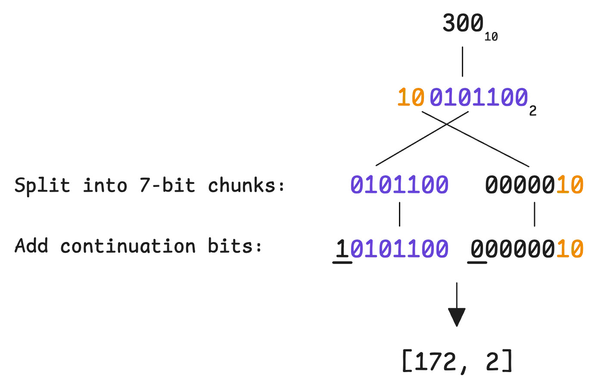
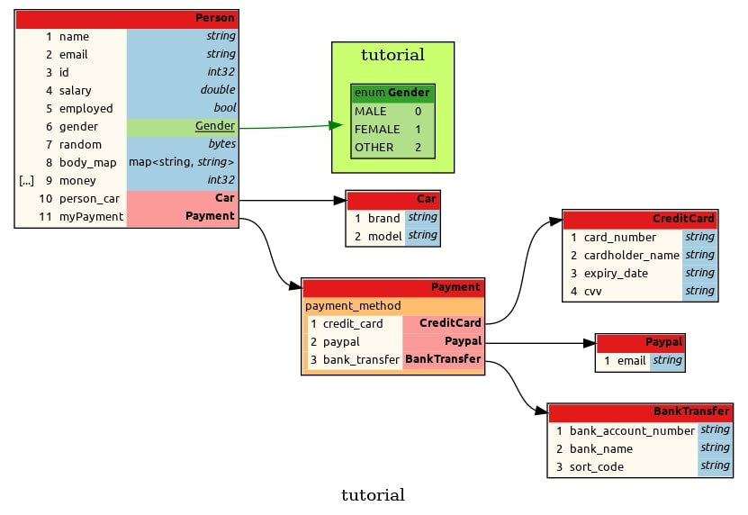

# Protocol Buffers (Protobuf)

Protocol Buffers, often referred to as Protobuf, is a language-neutral and platform-neutral mechanism for serializing structured data. It was originally developed by Google and later released as an open-source project.

Protobuf allows developers to define data structures in a schema file (`.proto`) and automatically generate code for multiple programming languages. These generated classes can then be used to serialize data into a compact binary format and deserialize it back into native objects.

Compared to text-based formats such as JSON or XML, Protobuf produces smaller messages, faster serialization and parsing, and stronger schema guarantees. Because of these properties, it is commonly used for data storage, inter-process communication, and efficient data exchange between systems.

Protocol Buffers is frequently used together with gRPC for defining service interfaces, but it is not limited to network communication. It can be used independently in any application that requires structured data serialization. We will go over gRPC in a separate document.

## Messages

In Protocol Buffers, a message is the primary data structure used to define the format of serialized data. A message is conceptually similar to a struct or class in many programming languages. Each message contains a set of fields that describe the data it holds. For example:

```protobuf
message Person {
  string name = 1;
  int32 id = 2;
  string email = 3;
}
```

Each field in a message has three components:

- Field type – the data type of the value (e.g., `string`, `int32`)
- Field name – the identifier used in code
- Field number – a unique numeric identifier used in the binary encoding

Field numbers are important because they determine how data is encoded in the serialized message and must remain stable for compatibility.

## Supported Data Types

Protocol Buffers supports a wide range of primitive and composite data types that allow developers to model complex data structures.

| **Category**         | **Type**     | **Description**                                        | **Example Usage**                                         |
|----------------------|--------------|--------------------------------------------------------|-----------------------------------------------------------|
| **Integer (varint)** | `int32`      | 32-bit signed integer                                  | `int32 age = 1;`                                          |
|                      | `int64`      | 64-bit signed integer                                  | `int64 timestamp = 2;`                                    |
|                      | `uint32`     | 32-bit unsigned integer                                | `uint32 id = 3;`                                          |
|                      | `uint64`     | 64-bit unsigned integer                                | `uint64 big_number = 4;`                                  |
| **Integer (fixed)**  | `fixed32`    | 32-bit fixed-size unsigned integer                     | `fixed32 checksum = 7;`                                   |
|                      | `fixed64`    | 64-bit fixed-size unsigned integer                     | `fixed64 hash = 8;`                                       |
|                      | `sfixed32`   | 32-bit fixed-size signed integer                       | `sfixed32 temperature = 9;`                               |
|                      | `sfixed64`   | 64-bit fixed-size signed integer                       | `sfixed64 balance = 10;`                                  |
| **Integer (ZigZag)** | `sint32`     | 32-bit signed integer                                  | `sint32 delta = 5;`                                       |
|                      | `sint64`     | 64-bit signed integer                                  | `sint64 change = 6;`                                      |
| **Floating-Point**   | `float`      | 32-bit floating-point number                           | `float weight = 11;`                                      |
|                      | `double`     | 64-bit floating-point number                           | `double height = 12;`                                     |
| **Boolean**          | `bool`       | Boolean value (`true` or `false`)                      | `bool is_active = 13;`                                    |
| **Text**             | `string`     | UTF-8 encoded text                                     | `string name = 14;`                                       |
| **Binary**           | `bytes`      | Raw byte sequence                                      | `bytes data = 15;`                                        |
| **Enumeration**      | `enum`       | Enumeration of predefined values                       | `enum Status { ACTIVE = 0; INACTIVE = 1; }`               |
| **Collection**       | `repeated`   | Repeated field (array/list)                            | `repeated string tags = 17;`                              |
| **Map**              | `map<K, V>`  | Key-value pair mapping                                 | `map<string, int32> scores = 18;`                         |
| **Union**            | `oneof`      | Mutual exclusive fields                                | `oneof contact { string email = 19; string phone = 20; }` |

### Variable-length Encoding

Variable-length encoding, commonly called `varint` encoding, is a technique used by Protocol Buffers to store integers using a variable number of bytes instead of a fixed-size representation. In this scheme, smaller numbers use fewer bytes, while larger numbers use more bytes. This approach improves storage and transmission efficiency because many real-world datasets contain a large number of small values, such as counters, identifiers, or status flags.

Varint encoding works by splitting an integer into 7-bit groups and storing each group in a byte. The most significant bit (MSB) of each byte is used as a continuation flag that indicates whether more bytes follow. If the MSB is set to 1, it means additional bytes are part of the number. If it is 0, the current byte is the final one. This design allows integers to be encoded using as few bytes as necessary. For example, a value between 0 and 127 requires only one byte, while larger numbers may require several bytes.



The primary reason for using varint encoding is efficiency. Because many values in typical data structures are small, varints significantly reduce the size of serialized messages compared to fixed-size integers. Smaller message sizes lead to lower storage requirements, faster network transmission, and improved overall performance when large volumes of data are exchanged.

However, varint encoding also has some limitations. Since the number of bytes used depends on the value, decoding requires additional logic to determine where the integer ends, which can slightly increase parsing complexity. In addition, very large numbers may require more bytes than a fixed-size representation would use. For example, a large 64-bit integer encoded as a varint can take up to 10 bytes, whereas a fixed-size 64-bit integer always requires 8 bytes. Because of this behavior, Protocol Buffers provides both variable-length types (such as `int32` and `int64`) and fixed-size types (`fixed32`, `fixed64`) so developers can choose the most efficient encoding for their data patterns.

| Category            | Types                                                           |
| ------------------- | --------------------------------------------------------------- |
| **Varint**          | `int32`, `int64`, `uint32`, `uint64`, `bool`, `enum`            |
| **Fixed-size**      | `fixed32`, `fixed64`, `sfixed32`, `sfixed64`, `float`, `double` |

### ZigZag Encoding

In Protocol Buffers, the types `sint32` and `sint64` represent signed integers that use a special encoding designed to efficiently handle negative numbers. The "s" in `sint` stands for signed, but more specifically it indicates that the value is encoded using **ZigZag** encoding, which improves the efficiency of representing negative integers in the binary format.

While varints are very efficient for small positive numbers, they are inefficient for negative numbers because negative values require the maximum number of bytes when encoded directly. The `sint` types solve this problem by applying ZigZag encoding before serialization. ZigZag transforms signed integers into unsigned integers in a way that keeps small positive and small negative numbers close to zero. As a result, both small positive and small negative values can be encoded using fewer bytes.

For example, with ZigZag encoding, the numbers 0, -1, 1, -2, 2 are mapped to 0, 1, 2, 3, 4. This transformation ensures that values near zero, whether positive or negative, are encoded efficiently. Because of this behavior, `sint32` and `sint64` are recommended when a field is expected to contain many negative numbers or values that frequently fluctuate around zero.

### Why Protocol Buffers Does Not Provide 8-bit or 16-bit Integer Types

Protocol Buffers does not include explicit 8-bit or 16-bit integer types (such as `int8` or `int16`). Instead, the smallest integer types available are `int32` and `uint32`. This design choice is intentional and is related to how Protocol Buffers encodes numeric values in its binary format.

With Variable-length (varint) encoding, the number of bytes used to store a value depends on the magnitude of the value rather than the declared type. Smaller numbers automatically occupy fewer bytes in the serialized message. For example, the value 5 will typically be encoded using a single byte even if the field type is declared as `int32`. Because of this adaptive encoding, introducing dedicated types like `int8` or `int16` would not significantly reduce the size of serialized data.

Another reason for limiting integer types to 32-bit and 64-bit variants is language interoperability and simplicity. Protocol Buffers is designed to generate code for many programming languages, and not all languages consistently support smaller integer types in a portable way. By standardizing on 32-bit and 64-bit types, the schema remains easier to implement and more consistent across different platforms.

If an application logically requires an 8-bit or 16-bit value, developers typically use `int32` or `uint32` in the schema and enforce the valid range within the application logic. The serialized representation will still remain compact due to varint encoding when small values are used.

## Nested Messages

Protocol Buffers allows messages to be nested inside other messages, enabling hierarchical data models and better organization of related structures. Nested messages behave like normal message types but are scoped within the parent message. This approach helps avoid naming conflicts and keeps logically related structures grouped together.

```protobuf
message Person {
    string name = 1;
    int32 age = 2;

    // Nested message
    message Address {
        string street = 1;
        string city = 2;
        string country = 3;
    }

    Address address = 3; // Using the nested message
}
```

In this example, the `Address` message is defined inside the `Person` message and used as the type of the `address` field. This keeps related data (like street, city, and country) encapsulated within `Person`, avoiding clutter and making the schema more modular.

## Example `.proto` File

A `.proto` file defines the schema used by Protocol Buffers. It contains message definitions, enumerations, and other constructs required to describe the data model in a language-neutral and platform-independent way. Create a `.proto` file named `person.proto` with this contents:

```protobuf
syntax = "proto3";  // Specify Protobuf version

package tutorial;   // Define package name (optional)

message Person {  // Define a message (data structure)
    string name = 1;
    string email = 2;
    int32 id = 3;
    double salary = 4;
    bool employed = 5;

    enum Gender {  // Define an enumeration
        MALE = 0;
        FEMALE = 1;
        OTHER = 2;
    }
    Gender gender = 6;

    bytes random = 7;

    map<string, string> body_map = 8;  // A map of key-value pairs
    repeated int32 money = 9;

    message Car {  // Nested message
        string brand = 1;
        string model = 2;
    }

    Car person_car = 10;  // Using the nested message

    // example for 'oneof'

    message Payment {  // Nested message
        oneof payment_method {
            CreditCard credit_card = 1;
            Paypal paypal = 2;
            BankTransfer bank_transfer = 3;
        }
    }

    message CreditCard {  // Nested message
        string card_number = 1;
        string cardholder_name = 2;
        string expiry_date = 3;
        string cvv = 4;
    }

    message Paypal {  // Nested message
        string email = 1;
    }

    message BankTransfer {  // Nested message
        string bank_account_number = 1;
        string bank_name = 2;
        string sort_code = 3;
    }

    Payment myPayment = 11;
}
```

## Visualizing `.proto` Files

Protocol Buffers does not provide built-in visualization tools for schema files. However, several third-party utilities can generate diagrams or documentation from `.proto` definitions. One such tool is [Protodot](https://github.com/seamia/protodot), which converts `.proto` files into Graphviz `.dot` format. These files can then be rendered as diagrams to visualize message relationships and structures.

Example workflow:

    ./protodot -src person.proto

Once the dot file is generated, you can generate the diagram using Graphviz.

    dot -Tpng output.dot -o person.png

This generates a graphical representation of the message schema.



## Protocol Buffers Compiler (`protoc`)

The Protocol Buffers compiler, commonly called `protoc`, converts `.proto` schema files into source code for a target programming language. The generated code provides classes or data structures that allow applications to:

- Construct message objects
- Serialize them into binary format
- Deserialize binary data back into structured objects

`protoc` is maintained in the official [Protocol Buffers repository](https://github.com/protocolbuffers/protobuf). Precompiled binaries are available for multiple operating systems and can be downloaded from the [releases page](https://github.com/protocolbuffers/protobuf/releases/latest). Each release provides archive packages named in the format `protoc-$VERSION-$PLATFORM.zip`, which include the `protoc` executable along with a collection of standard `.proto` definitions. The versioning of `protoc` corresponds to the minor version of the Protocol Buffers language implementation. For example, Protocol Buffers Python version 5.29.x typically uses protoc version 29.x. This alignment helps ensure compatibility between the compiler and the language-specific runtime libraries used in applications.

Install the latest `protoc` on Ubuntu by:

    wget https://github.com/protocolbuffers/protobuf/releases/download/v34.0/protoc-34.0-linux-x86_64.zip
    unzip protoc-34.0-linux-x86_64.zip -d $HOME/.local/
    export PATH="$HOME/.local/bin:$PATH"

Close and open your terminal, and check the version:

    protoc --version
    libprotoc 34.0

## Compiling `.proto` Files

To generate source code from a `.proto` file, the `protoc` compiler is invoked with language-specific options.

    mkdir generated_python
    protoc -I=. --python_out=./generated_python ./person.proto

This command reads the schema file and generates language-specific classes (in this case `person_pb2.py`) that implement serialization and deserialization logic. Similar commands can generate code for many supported languages, including C++, Java, Go, C#, and others.

To generate code for C++:

    mkdir generated_cpp
    protoc -I=. --cpp_out=./generated_cpp ./person.proto

To generate code for Java:

    mkdir generated_java
    protoc -I=. --java_out=./generated_java ./person.proto


## Generated Code Header

The header at the top of `person_pb2.py` is automatically inserted by the Protocol Buffers compiler (`protoc`) when it generates Python code from a `.proto` file. This section provides metadata about how the file was produced and helps both developers and the runtime library understand how the generated code should be used.

```python
# -*- coding: utf-8 -*-
# Generated by the protocol buffer compiler.  DO NOT EDIT!
# NO CHECKED-IN PROTOBUF GENCODE
# source: person.proto
# Protobuf Python Version: 7.34.0
"""Generated protocol buffer code."""
```

The line "Generated by the protocol buffer compiler. DO NOT EDIT!" indicates that the file is machine-generated and should not be modified manually. Any changes made directly to this file may be lost the next time the `.proto` file is compiled. Instead, developers should modify the original `.proto` schema and regenerate the code. The line "source: person.proto" identifies the schema file from which the code was generated, making it easier to trace the origin of the definitions.

The line "Protobuf Python Version: 7.34.0" specifies the version of the Protocol Buffers Python code generator used when the file was created. This information is important because the generated code depends on the Protocol Buffers Python runtime library (`google.protobuf`). When the module is imported, the runtime checks whether its own version is compatible with the version used to generate the code. If the runtime library is older than the required version, it raises an error to prevent incompatibility issues during serialization or deserialization.

Finally, the line "Generated protocol buffer code." is simply a module-level docstring describing the purpose of the file. Together, these header lines provide context, version tracking, and safety checks that help ensure the generated code remains consistent with the Protocol Buffers compiler and runtime environment used in the application.

## Use the Generated Code in Python

Once the code is generated, applications can create message objects, populate their fields, serialize them into binary format, and later reconstruct the same objects by deserializing the binary data. Serialized data can be transmitted over a network, written to files, or exchanged between processes. Because the serialization format is compact and schema-based, Protocol Buffers provides both high performance and strong compatibility guarantees.

Create `use_person.py` with the following content. This program demonstrates how to create, serialize, and deserialize a Protocol Buffers message using the classes generated from `person.proto`.

```python
import os
import sys

# Add the 'generated_python' directory to the Python path

sys.path.append(os.path.abspath('./generated_python'))

import person_pb2


def populate_person():

    body_map = {
        "height": "6 feet",
        "weight": "180 pounds"
    }

    # Create a Car instance
    car = person_pb2.Person.Car(
        brand="Toyota",
        model="Camry"
    )

    # Create a Person instance
    person = person_pb2.Person(
        name="John Doe",
        email="john.doe@example.com",
        id=12345,
        salary=50000.00,
        employed=True,
        gender=person_pb2.Person.MALE,
        random=b'\x01\x02\x03\x04',
        body_map=body_map,
        money=[100, 500, 1000],
        person_car=car,
    )

    # Setting up the payment method
    person.myPayment.credit_card.card_number = "1234567890123456"
    person.myPayment.credit_card.cardholder_name = "John Doe"
    person.myPayment.credit_card.expiry_date = "12/25"
    person.myPayment.credit_card.cvv = "123"

    return person


def main():

    person = populate_person()

    ################################################

    # Serialize the Person to a binary string
    serialized_person = person.SerializeToString()

    # Deserialize the binary string back into a new Person object
    new_person = person_pb2.Person()
    new_person.ParseFromString(serialized_person)

    # Print the deserialized Person
    print("Deserialized Person:", new_person)

    ################################################

    # Save serialized data to a file
    with open("person.bin", "wb") as f:
        f.write(serialized_person)

    # Read serialized data from the file
    with open("person.bin", "rb") as f:
        serialized_person = f.read()

    # Deserialize the binary string back into a new Person object
    new_person = person_pb2.Person()
    new_person.ParseFromString(serialized_person)

    # Print the deserialized Person
    print("Deserialized Person:\n", new_person)


if __name__ == "__main__":

    main()
```

You can invoke the program with:

    python3 use_person.py

You might get the following error message:

```text
google.protobuf.runtime_version.VersionError: Detected incompatible Protobuf Gencode/Runtime versions when loading person.proto: gencode 7.34.0 runtime 6.33.5. Runtime version cannot be older than the linked gencode version. See Protobuf version guarantees at https://protobuf.dev/support/cross-version-runtime-guarantee.
```

This means that you have a compiler/runtime version mismatch. Your `person_pb2.py` file was generated by `protoc` 34.0, and the generated code reports its Python gencode version as 7.34.0, but your installed Python protobuf runtime is only 6.33.5. Python’s protobuf runtime requires the runtime version to be at least as new as the generated code version, so import fails before your script even runs.

The key point is that installing `protoc` alone is not enough for Python. The official protobuf project separates the compiler from the language runtime, and Python code generated by newer protobuf releases must be used with a compatible protobuf Python package. The protobuf docs explicitly note compatibility rules between generated code and runtime, and the official repository also distinguishes installing the compiler from installing the runtime for your chosen language.

The cleanest fix is to upgrade your Python protobuf runtime so it matches the compiler generation version:

    python3 -m pip install --upgrade "protobuf==7.34.0"

## Versioning and Backward Compatibility

One of the strengths of Protocol Buffers is that message schemas can evolve over time without breaking compatibility with previously serialized data. This is achieved by maintaining stable field numbers and following a few simple rules when modifying the schema.

Suppose the original version of a message is defined as follows:

```protobuf
message Person {
  string name = 1;
  int32 id = 2;
}
```

A program using this schema might serialize the following message:

```text
name = "Alice"
id = 100
```

The serialized binary data contains the field numbers (1 and 2) along with the encoded values.

Later, the schema evolves to include an email address:

```protobuf
message Person {
  string name = 1;
  int32 id = 2;
  string email = 3;
}
```

This change is backward compatible. Older programs that only understand fields 1 and 2 will simply ignore the new email field when reading the message. Similarly, new programs reading older data will still work because the email field will just be missing.

Example message in Version 2:

```text
name = "Alice"
id = 100
email = "alice@example.com"
```

An older application using Version 1 will still successfully read the `name` and `id` fields.

If a field is no longer needed, it should not be removed without reserving its field number. For example:

```protobuf
message Person {
  string name = 1;
  reserved 2;
  string email = 3;
}
```

The `reserved` statement prevents field number 2 from being reused in the future. This avoids situations where older serialized data might incorrectly map a reused field number to a different meaning.
