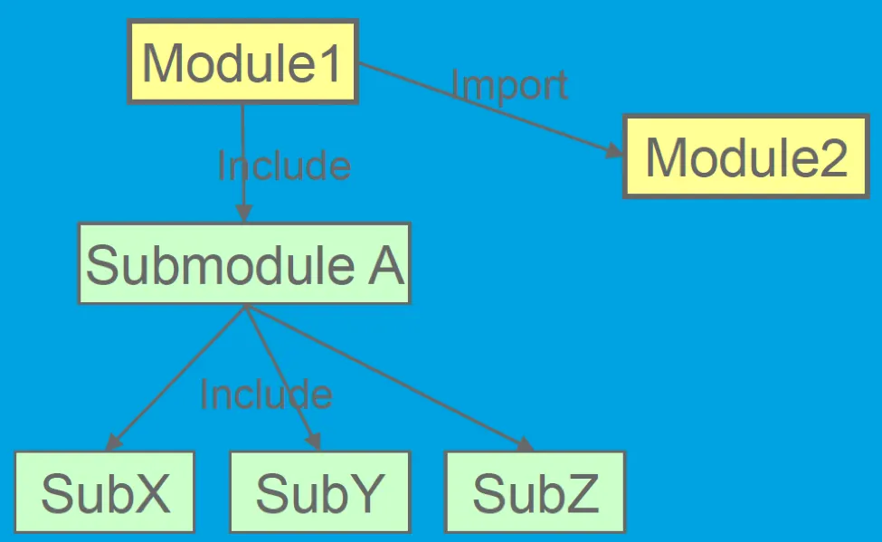
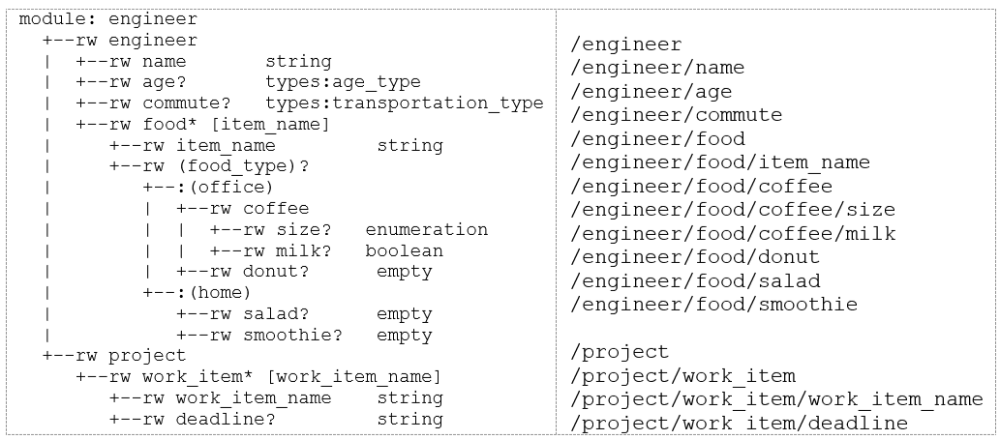
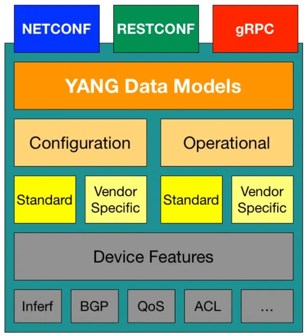

# Network Management Protocols

Network management protocols define how external systems such as monitoring platforms, controllers, or automation frameworks communicate with network devices like routers and switches. These protocols allow management systems to retrieve operational data, configure device parameters, and monitor the health and performance of network infrastructure in a structured and programmatic way.

Historically, one of the earliest and most widely deployed network management protocols is `SNMP` (Simple Network Management Protocol). Introduced in the late 1980s, SNMP was primarily designed for monitoring network devices. It allows management systems to query devices for operational metrics such as interface counters, CPU utilization, memory usage, and other statistics. SNMP organizes this information using Management Information Bases (MIBs), which define the structure of the data that can be retrieved from a device.

Although SNMP technically supports configuration changes, it has historically been used mainly for monitoring. Its data models were relatively rigid and not well suited for representing complex hierarchical configuration data. As networks became larger and automation became more important, engineers increasingly relied on device Command Line Interfaces (CLI) for configuration. However, automating CLI interactions required parsing text output (a fragile technique commonly referred to as **screen scraping**). Even small formatting changes in CLI output could break automation scripts, making large-scale automation difficult to maintain.

To address these limitations, the networking industry moved toward model-driven network management. This approach separates the data model from the transport protocol, allowing devices and management systems to exchange structured data defined by a common schema. As part of this effort, the IETF introduced `YANG`, a standardized data modeling language designed specifically for network configuration and operational data.

## YANG (Yet Another Next Generation)

YANG is a data modeling language used to describe the configuration and operational data of network devices such as routers, switches, and firewalls. It defines the structure of network management data, including the hierarchy of configuration elements, allowed data types, constraints, and relationships between fields.

In practical terms, YANG acts as a schema for network device data. For example, if a network operator needs to configure an interface IP address or retrieve interface statistics, the YANG model defines the exact structure of those data elements, their types, and any valid ranges. This ensures that both network devices and management systems interpret configuration and operational data in a consistent and predictable way.

Unlike SNMP MIBs, which were primarily designed for monitoring, YANG was built to support both configuration management and operational state retrieval. Its hierarchical data model makes it possible to represent complex device configurations in a structured and vendor-neutral way. This enables automation platforms to interact with devices from different vendors using a consistent schema.

## YANG Module Structure

A YANG module defines a complete data model. Each module typically contains three major sections:

- Module header statements: identify the module and its namespace.
- Revision statements: track the history of changes made to the module.
- Definition statements: describe the actual data structures.

Let us go over a sample YANG module. The name of this YANG module is `engineer` and it represents a data model for engineers in a company. We will add more items into this YANG module later on.

```yang
module engineer {
    yang-version 1.1;
    namespace "urn:nokia.com:srexperts:engineer";
    prefix "engineer";
    revision 2019-05-06;
    container engineer {
        description "Its me";
        leaf name {
            mandatory true;
            type string;
        }
        leaf age {
            type uint8;
        }
    }
}
```

The `yang-version` statement is not the version number of the module but the version number of the YANG definition that the author has written the module to. Currently this would be 1.0 or 1.1. If this is a new module then starting with the latest version is advisable. A module that doesn't contain the `yang-version` statement, is developed for YANG version 1.0.

The `namespace` statement defines the XML namespace that all identifiers defined by the module are qualified by in the XML encoding. The argument to the namespace statement is the URI of the namespace.

The `prefix` is the short name that can be used to quickly reference the modules. The prefix string may be used with the module to refer to definitions contained in the module, e.g., "if:ifName".

The `revision` statement specifies the editorial revision history of the module, including the initial revision. A series of revision statements detail the changes in the module's definition. The argument is a date string in the format "YYYY-MM-DD", followed by a block of sub-statements that holds detailed revision information. A module should have at least one revision statement. Note that for every published editorial change, a new one should be added in front of the revisions sequence so that all revisions are in reverse chronological order.

A `container` is used to group related nodes in a subtree. A container has only child nodes and no value. It may contain any number of child nodes of any type. As with the other items created so far, a short description should be added for a container. Inside a container a number of information elements, or leaves, will be placed. Container can be thought of a branch in a tree and leaves are the end of a branch where our information will sit. Containers and leaves should be used hierarchically. Containers can exist inside containers, however, containers cannot exist inside leaves.

In our example above, container `engineer` has two leaves. The keyword `leaf` is used and then the leaf name is given. In this case, the leaf name is `name`. Each leaf has a type. In this case, the type is the built-in YANG type, `string`. We will go over built-in YANG types in future section. The `mandatory` tag is a boolean and should be set to true if the field is required and false (or not added at all, as the default is false) if not.

### YANG Tree Structure

YANG models represent configuration and operational data as a hierarchical tree. Each node in the tree corresponds to a data element defined in the YANG model.

Tools such as [pyang](https://github.com/mbj4668/pyang) can generate a tree representation of the model. Pyang is an open source tool that allows users to compile a YANG module in order to validate and visualize the YANG model in various output formats.

Save the YANG module that we discussed in the previous section into a file and name it `engineer.yang`. It is good practice to use the module name as the YANG filename (pyang and other similar tools will flag a warning if the names are not the same). Ensure that your system has pyang installed. From the same directory as the YANG file, invoke the following command:

    pyang -f tree engineer.yang

The tree representation of the YANG module is shown as following:

```text
module: engineer
  +--rw engineer
     +--rw name    string
     +--rw age?    uint8
```

Each node is printed as:

    <status>--<flags> <name><opts> <type> <if-features>

For example, the leaf node `age` is printed as:

    +--rw age?

In this representation:

- `+` indicates the node is current
- `rw` indicates read-write configuration data
- `?` indicates the node is optional

This tree representation helps engineers understand how configuration data is organized inside the model. Refer to the output of `pyang --tree-help` for more detailed information.

### Built-in Types in YANG

YANG provides a set of built-in data types. These types are similar to those found in programming languages but include additional constraints useful for network management. The following table summarizes the built-in types in YANG.

| **Type**              | **Description**                     |
| --------------------- | ----------------------------------- |
| `uint8`               | 8-bit unsigned integer              |
| `uint16`              | 16-bit unsigned integer             |
| `uint32`              | 32-bit unsigned integer             |
| `uint64`              | 64-bit unsigned integer             |
| `int8`                | 8-bit **signed** integer            |
| `int16`               | 16-bit **signed** integer           |
| `int32`               | 32-bit **signed** integer           |
| `int64`               | 64-bit **signed** integer           |
| `decimal64`           | 64-bit **signed** decimal number    |
| `string`              | A character string                  |
| `boolean`             | Boolean value (`true` or `false`)   |
| `bits`                | A set of bits or flags              |
| `binary`              | Any binary data                     |
| `empty`               | A leaf that does not have any value |
| `enumeration`         | One of an enumerated set of strings |
| `union`               | Choice of member types              |
| `identityref`         | A reference to an abstract identity |
| `instance-identifier` | A reference to a data tree node     |
| `leafref`             | A reference to a leaf instance      |

### Derived Types in YANG

YANG can also define derived types from base types using the `typedef` statement. A base type can be either a built-in type or a derived type, allowing a hierarchy of derived types. A derived type can be used as the argument for the `type` statement. Here is an example that defines a derived type called `percent`.

```yang
typedef percent {
    type uint8 {
        range "0 .. 100";
    }
}

leaf completed {
    type percent;
}
```

Let us improve our engineer YANG module by leveraging derived types. We are going to create `age_type` to represent the age of the engineer. This derived type describes the age of the engineer between the legal working age and retirement age. The age range is defined using the `range` statement. We will use age 18 as the legal working age and age 110 as the retirement age. The `..` characters are special and mean between. We can also use the `units` statement to provide the contextual unit of the range number.

```yang
module engineer {
    yang-version 1.1;
    namespace "urn:nokia.com:srexperts:engineer";
    prefix "engineer";
    revision 2019-05-06;
    typedef age_type {
        description "Engineers start work at 18 and retire by 110";
        type uint8 {
            range "18 .. 110";
        }
        units years;
    }
    container engineer {
        description "Its me";
        leaf name {
            mandatory true;
            type string;
        }
        leaf age {
            type age_type;
        }
    }
}
```

### Import and Include in YANG

Large YANG models are often divided into multiple files to improve organization, reuse, and maintainability. YANG provides two mechanisms for referencing definitions across files: `include` and `import`. Although both allow one file to reference definitions from another, they serve different purposes and operate under different namespace rules.

| Feature              | `include`                                                      | `import`                                                  |
| -------------------- | -------------------------------------------------------------- | --------------------------------------------------------- |
| **Target**           | Submodules belonging to the same module                        | Completely separate modules                               |
| **Namespace**        | Same namespace as the parent module                            | Different namespace from the calling module               |
| **Prefix Required?** | No                                                             | Yes                                                       |
| **Primary Purpose**  | File organization (splitting one large module into submodules) | Code reuse (leveraging definitions from external modules) |

A submodule is a portion of a larger YANG module that has been separated into its own file for readability or maintainability. Even though the definitions are distributed across multiple files, they still logically belong to a single module. From the perspective of systems using the model, the module and all its submodules appear as one unified data model.



The `include` statement is used to incorporate a submodule into its parent module. Because the submodule belongs to the same module, it shares the same namespace and prefix as the parent. This means definitions inside the submodule can be referenced directly without adding a prefix. The primary purpose of `include` is therefore file organization, allowing a large module to be split into smaller pieces while still forming a single logical model.

The `import` statement, on the other hand, is used to reference definitions from a completely separate YANG module. Since each module has its own namespace, importing a module requires assigning a prefix. This prefix is used to qualify any types, groupings, or other definitions taken from the imported module. Using prefixes prevents naming conflicts when multiple modules define similarly named elements.

In practice, `import` is commonly used to reuse definitions that are shared across multiple modules. For example, a module might import common data types or reusable structures defined in another module. This encourages modular design and avoids duplicating the same definitions in multiple places.

Consider a module named `engineer_types.yang` that defines reusable data types. These types can then be imported and referenced from another module. This module defines two reusable types: `age_type` and `transportation_type`.

engineer_types.yang

```yang
module engineer_types {
    yang-version 1.1;
    namespace "urn:nokia.com:srexperts:types";
    prefix "types";
    revision 2019-05-06;
    typedef age_type {
        description "Engineers start work at 18 and retire by 110";
        type int8 {
            range "18 .. 110";
        }
        units years;
    }
    typedef transportation_type {
        description "Method of transportation";
        type enumeration {
            enum foot;
            enum bicycle;
            enum car;
            enum bus;
            enum train;
            enum boat;
            enum aeroplane;
        }
    }
}
```

A second module, `engineer.yang`, can import these definitions.

engineer.yang

```yang
module engineer {
    yang-version 1.1;
    namespace "urn:nokia.com:srexperts:engineer";
    prefix "engineer";
    import engineer_types {
      prefix "types";
    }
    revision 2019-05-06;
    container engineer {
        description "Its me";
        leaf name {
            mandatory true;
            type string;
        }
        leaf age {
            type types:age_type;
        }
        leaf commute {
            type types:transportation_type;
        }
    }
}
```

In this example, the `engineer` module imports the `engineer_types` module and assigns it the prefix `types`. When referencing the imported definitions, the prefix is used (for example, `types:age_type`). This tells the YANG compiler exactly which module the type belongs to.

When a YANG compiler processes a module, it resolves dependencies by following any `import` or `include` statements encountered in the module header. The compiler loads the referenced modules or submodules so that all type definitions, groupings, and structures can be properly validated. For this reason, YANG specifications require that `import` and `include` statements appear in the header section of a module, before the main body of the data model.

### List and Choice in YANG

Now we have a basic YANG model comprising derived types and a number of leaves. This module can be enhanced with some additional fields. Engineers work on projects and need to eat and drink. The `project` will be a separate branch in the tree which means that it will be a container inside the `engineer` container.

As an engineer can work on zero or more work items, we will create a list called `work_item`. This list has two leaves: `work_item_name` and `deadline`. Lists require a specific field to be used as the key. The key entered must match a leaf inside the list. In this tutorial, the key will be called `work_item_name`.

The `ordered-by` statement defines whether the order of entries within a list are determined by the user or the system. The argument is one of the strings "system" or "user". If not present, ordering defaults to "system". System ordered lists can appear in any order the server deems appropriate. This is often used where the processing of any items in a list is not dependent on any other item in that list. User ordered lists will appear in the tree based on the order in which they appear in the YANG module file. This is the order in which the list must be processed by any server.

```yang
container engineer {
    container project {
        list work_item {
            key "work_item_name";
            ordered-by user;
            leaf work_item_name {
                type string;
            }
            leaf deadline {
                type string;
            }
        }
    }
}
```

YANG allows the data model to segregate incompatible nodes into distinct choices using the `choice` and `case` statements.  The `choice` statement contains a set of case statements that define sets of schema nodes that cannot appear together. Each case may contain multiple nodes, but each node may appear in only one case under a choice.

```yang
container engineer {
    list food {
        key "item_name";
        ordered-by system;
        leaf item_name {
            type string;
        }
        choice food_type {
            case office {
                container coffee {
                    leaf size {
                        type enumeration {
                            enum tall;
                            enum grande;
                            enum venti;
                        }
                    }
                    leaf milk {
                        type boolean;
                    }
                }
                leaf donut {
                    type empty;
                }
            }
            case home {
                leaf salad {
                    type empty;
                }
                leaf smoothie {
                    type empty;
                }
            }
        }
    }
}
```

The new YANG tree will look like this:

```text
module: engineer
  +--rw engineer
  |  +--rw name       string
  |  +--rw age?       types:age_type
  |  +--rw commute?   types:transportation_type
  |  +--rw food* [item_name]
  |     +--rw item_name         string
  |     +--rw (food_type)?
  |        +--:(office)
  |        |  +--rw coffee
  |        |  |  +--rw size?   enumeration
  |        |  |  +--rw milk?   boolean
  |        |  +--rw donut?      empty
  |        +--:(home)
  |           +--rw salad?      empty
  |           +--rw smoothie?   empty
  +--rw project
     +--rw work_item* [work_item_name]
        +--rw work_item_name    string
        +--rw deadline?         string
```

## YIN

A YANG module can be translated into an alternative XML-based syntax called `YIN`. The translated module is called a YIN module. The YANG and YIN formats contain equivalent information using different notations. The YIN notation enables developers to represent YANG data models in **XML** and therefore use the rich set of XML-based tools for data filtering and validation, automated generation of code and documentation, and other tasks. Tools like `XSLT` or XML validators can be utilized.

A YANG module can be translated into YIN syntax without losing any information. The following invocation converts our `engineer.yang` module into YIN.

    pyang engineer.yang -f yin -o engineer.yin

## XML Path Language (XPath)

XPath (XML Path Language) is a syntax for defining parts of an XML document. YANG models leverage XPath expressions to specify constraints, conditions, and relationships between data elements defined in the YANG model. The following invocation shows all XPath in our `engineer.yang` module.

    pyang --plugindir . -f xpath engineer.yang



Suppose we want to add a constraint where the `commute` method of transportation is only applicable for engineers over a certain age, let's say 18. We can use a `must` statement with an XPath expression to enforce this rule. The `must` statement defines a constraint that must be satisfied for the data to be considered valid. It uses an XPath expression to specify the condition that must be true.

```yang
leaf age {
	type types:age_type;
}
leaf commute {
	type types:transportation_type;
	must "../age >= 18" {
		error-message "Engineer must be at least 18";
	}
}
```

The expression above checks the value of the `age` leaf at the same hierarchical level as `commute` (indicated by `..`, which navigates up to the parent node, then selects the `age` leaf). If the condition is not met, the model will violate the constraint, triggering the error-message. This use of XPath allows you to define complex logic and interdependencies between data elements in a YANG model, ensuring the data's integrity and applicability within the defined constraints.

We can use XPath with `when` statement. The `when` statement effectively makes the inclusion of certain configuration data conditional, allowing for more flexible and context-sensitive data models. This mechanism is particularly useful for creating models that adapt to different scenarios or configurations dynamically. As an example, if the condition specified by the `when` statement is not met (meaning if the age is less than 18), the `commute` leaf is not considered relevant or applicable, and thus it won't be required or present in the data structure for those instances.

```yang
leaf age {
	type types:age_type;
}
leaf commute {
	type types:transportation_type;
	when "../age >= 18" {
		description "is applicable for engineers >= 18 years old";
	}
}
```

## Standard Vs. Vendor-Specific YANG Models

YANG models can be developed by standards organizations or individual vendors.

**Standardized** models, typically developed through the IETF, define common structures for widely used network protocols and services. These models enable interoperability between devices from different vendors. These models are developed within working groups, and their creation process involves community input, drafts, and consensus before reaching publication as RFCs.

Companies that produce network hardware and software (like Cisco, Juniper, Huawei, Arista, and others) create their own models to represent the configuration and operational data for their devices. These models often extend or specialize standard models to cover **vendor-specific** features or provide detailed models for proprietary technologies.

It is common for different vendors to create their own YANG models for the same network protocols or services. This situation arises because while a protocol itself may be standardized, different vendors might implement the protocol with vendor-specific features or extensions that are not covered by the standard models or they may choose to model standard features in ways that align more closely with their particular device architectures and management philosophies.



The existence of both standard and vendor-specific YANG models means that network operators often need to work with a mix of model types to fully manage their networks, especially in multi-vendor environments. This can complicate network management but also offers the flexibility to leverage the best features and capabilities of each vendor's devices. Tooling and platforms that can abstract these differences and normalize configurations across devices can help mitigate some of the complexity introduced by vendor-specific models.

## OpenConfig YANG Models

OpenConfig is an effort among multiple network operators to develop and deploy vendor-neutral data models for configuring and managing networks in a standardized and simplified manner. It represents a collaborative initiative aimed at moving network configuration away from traditional, vendor-specific interfaces towards a more open, model-driven approach.

OpenConfig's primary focus is on creating YANG models that are directly usable for automating the configuration and management of network devices. OpenConfig data models are written in YANG v1.0. The official distribution channel for OpenConfig YANG models is [this](https://github.com/openconfig/public/) public GitHub repository. You can find the documentations in [here](https://openconfig.net/projects/models/schemadocs/).
