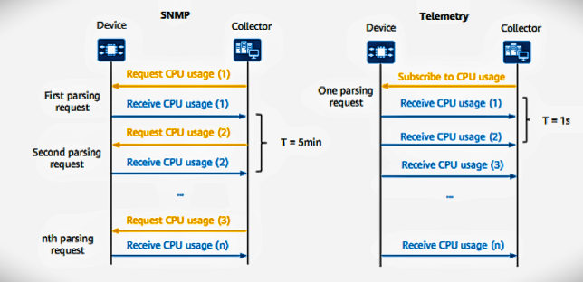
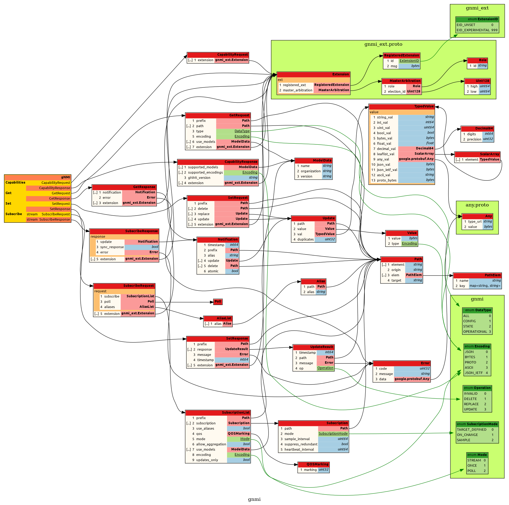
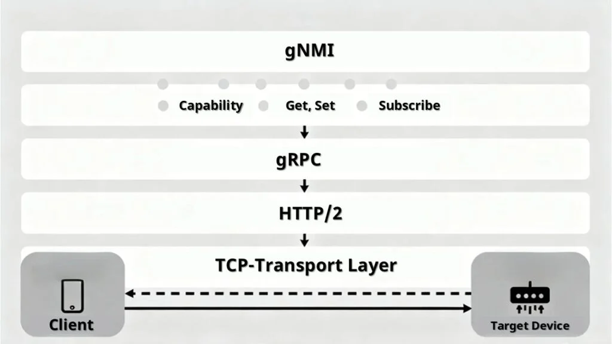

# gNMI (gRPC Network Management Interface)

gNMI is a modern, open network management protocol designed to configure network devices, retrieve operational state, and stream real-time telemetry data. It was developed to address the scalability and performance challenges that emerged as data center networks grew to hyperscale sizes.

Earlier [management protocols](./06_README_network_management.md) such as SNMP, NETCONF, and RESTCONF each addressed important aspects of network management but introduced limitations that became more apparent as networks grew larger and more dynamic. gNMI was designed specifically to overcome these limitations through efficient transport, compact data encoding, and a push-based telemetry model.

## YANG Data Models in gNMI

gNMI provides the RPC mechanisms for transporting management data between a client and a network device, but it does not define the structure or meaning of that data. This is where [YANG](./05_README_yang.md) data models play a critical role. YANG organizes configuration and operational data into a structured hierarchical tree. Each configuration element or telemetry metric has a clearly defined path within this tree. For example:

```text
/interfaces/interface[name=Ethernet0]/state/counters/in-octets
```

gNMI uses these YANG-defined paths in all of its RPC operations. When a client performs a `Get`, `Set`, or `Subscribe` operation, it specifies paths within this YANG data tree. Many gNMI deployments use OpenConfig YANG models, which are vendor-neutral schemas designed to work across multiple networking platforms. This allows the same gNMI client to configure devices from different vendors using the same data model.

In summary:

- YANG provides the structured data model
- gNMI provides the transport and RPC framework

## Key Design Principles

gNMI was designed with three major goals: efficient transport, compact data encoding, and real-time telemetry delivery.

### Transport Layer: gRPC over HTTP/2

gNMI uses [gRPC](./04_README_gRPC.md) as its transport mechanism, which runs on top of HTTP/2. Unlike older protocols that rely on SSH or stateless HTTP request-response semantics, HTTP/2 allows for persistent multiplexed connections. A client establishes a single secure TLS connection to a network device and can then exchange multiple concurrent requests and telemetry streams over that same connection. This greatly reduces connection overhead and improves performance in large-scale environments.

### Efficient Data Encoding: Protocol Buffers

While gNMI can support JSON encoding, its native format is [Protocol Buffers](./03_README_proto.md) (Protobuf). Protobuf is a compact binary serialization format that is significantly smaller and faster to process than text-based formats like XML or JSON. Because network devices often have limited CPU resources, this efficiency reduces processing overhead and improves telemetry throughput.

### Streaming Telemetry

One of the most powerful capabilities of gNMI is its streaming telemetry mechanism. Instead of repeatedly polling devices for data, clients can subscribe to specific data paths to receive continuous updates. This **push-based** telemetry model is far more efficient than traditional **poll-based** methods such as SNMP or periodic REST queries. It significantly reduces network overhead and provides near real-time visibility into network behavior, making it particularly suitable for large-scale environments where thousands of devices must be monitored in real time.



> The primary drawback of gNMI is its higher technical complexity compared to REST-based interfaces. Developers must work with gRPC frameworks, compile Protocol Buffer definitions, and manage client libraries. This requires a stronger software development workflow than simply sending HTTP requests to a REST API. However, the performance and scalability benefits often outweigh this additional complexity in modern network infrastructures.

## Where Are the Definitions and Standards?

gNMI is developed and maintained by the OpenConfig working group, a collaborative initiative originally driven by large network operators such as Google, Microsoft, and AT&T. The goal of OpenConfig is to define vendor-neutral management interfaces and data models that work consistently across different networking platforms. The official specifications and code definitions are publicly available in the OpenConfig repositories.

The authoritative specification describing how gNMI clients and servers interact is documented in [gnmi-specification.md](https://github.com/openconfig/reference/blob/master/rpc/gnmi/gnmi-specification.md). This document defines the protocol behavior, message structure, RPC semantics, and expected interactions between clients and network devices.

Because gNMI is implemented using gRPC, its entire architecture is defined using Protocol Buffer (`.proto`) files. The most important file is [gnmi.proto](https://github.com/openconfig/gnmi/blob/master/proto/gnmi/gnmi.proto). This file defines:

- the gNMI service
- the RPC operations
- the message structures used for requests and responses

The `.proto` definitions are compiled using `protoc` to generate client and server libraries in multiple programming languages. The following shows a graphical representation of the `gnmi.proto`.



You may notice references to gNMI extensions. These extensions are defined in [gnmi_ext.proto](https://github.com/openconfig/gnmi/blob/master/proto/gnmi_ext/gnmi_ext.proto). This file allows vendors or platform implementations to add optional extensions to the core gNMI protocol without modifying the standard message definitions. By separating extensions into a dedicated module, the core gNMI protocol remains stable and interoperable while still allowing vendors to introduce additional functionality.

## gNMI RPC Operations

Within the `gnmi.proto` definitions, gNMI declares a service that exposes four main RPC operations. These operations define the primary management capabilities provided by the protocol.



### Capabilities

The Capabilities RPC is used for discovery. Before performing any management operations, a client can query the device to determine:

- which version of gNMI the device supports
- which YANG data models are implemented
- what encodings are supported

This allows clients to dynamically adapt their requests to the capabilities of the device.

### Get

The Get RPC retrieves data from the device. A client specifies a YANG path and the device returns the current value along with a timestamp. This operation is typically used to retrieve configuration values or operational state information.

### Set

The Set RPC modifies the device configuration. It supports three types of configuration operations:

- **Update**: modifies a specific value at a path
- **Replace**: replaces an entire subtree of configuration data
- **Delete**: removes a configuration node

These allow a client to programmatically modify network configuration using structured YANG paths.

### Subscribe

The Subscribe RPC enables streaming telemetry. Instead of polling the device repeatedly, a client subscribes to specific YANG data paths and receives updates automatically. Subscriptions support several modes:

- **SAMPLE**: updates are sent at a fixed interval (e.g., reporting CPU usage every 10 seconds).
- **ON_CHANGE**: updates are sent whenever a value changes (e.g., a link state changes to down).
- **TARGET_DEFINED**: the device determines the optimal reporting behavior (either sampled or on-change).

This push-based telemetry model is one of the primary reasons gNMI is widely adopted in large-scale data center networks.
