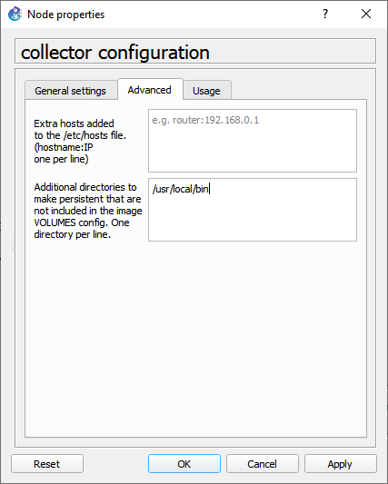

## Setting up the Management Host

The management-host is implemented as a Docker container based on Ubuntu 20.04.2 LTS. In this topology it functions primarily as a DHCP server, allowing SONiC switches and other nodes to automatically obtain management IP addresses. Providing DHCP simplifies the lab setup and mimics real data center deployments where switches are provisioned automatically during boot. Once the switches receive their management addresses, they can be reached by automation systems, telemetry collectors, and configuration tools.

> Follow the instructions in [here](https://github.com/ManiAm/GNS-Bench/blob/master/docs/Management_host.md) to configure DHCP on the management host.

## Setting up the `gnmi` Service in Sonic

SONiC manages its internal services through the "Feature Framework", which allows individual services to be enabled or disabled at runtime. You can verify whether the gNMI telemetry service is enabled using:

    show feature status | grep gnmi

If the feature is enabled, SONiC launches the gNMI service inside a dedicated Docker container called `gnmi`. To confirm that the container is running:

    docker ps | grep gnmi

Inside this container, the telemetry service exposes a gRPC endpoint that external clients can connect to in order to retrieve operational state or subscribe to telemetry streams. The gNMI server itself is implemented by a process called `telemetry`, which listens for incoming gRPC connections. You can verify that it is listening for connections using:

    sudo ss -lntp | grep telemetry

Example output:

    LISTEN 0      512                *:8080            *:*    users:(("telemetry",pid=5648,fd=12))

This output indicates that the telemetry process is listening on TCP port 8080, which is the default gNMI service port used in SONiC.

## gNMI Port

In most standard and community SONiC deployments, the `gnmi` container listens on port 8080 by default for insecure (plaintext) connections. In production environments where TLS/SSL is enabled for secure communication, gNMI is frequently configured to use port 50051 or 9339 (the standard OpenConfig gNMI port).

Because SONiC is a fundamentally data-driven operating system, the `gnmi` container gets its operational parameters directly from the centralized Redis `CONFIG_DB`. To change the port, you need to update the `CONFIG_DB` and then restart the gNMI service.

While it is possible to manually edit the `config_db.json` startup file, JSON syntax errors can cause configuration loads to fail. The safest and most reliable method is to inject the configuration directly into the running Redis database and then save those changes to disk.

This command creates or updates the `GNMI|gnmi` table, sets the port to 9339, enables the service, and disables client authentication for testing purposes:

    sudo sonic-db-cli CONFIG_DB hmset 'GNMI|gnmi' port 9339 admin_status up client_auth false

This ensures your changes are written to `/etc/sonic/config_db.json` and will survive a system reboot:

    sudo config save -y

Restarting the container forces it to read the newly updated parameters from the Redis database.

    sudo docker restart gnmi

Check the active listening sockets to confirm the `gnmi` service is now bound to the new port.

    sudo ss -lntp | grep telemetry

Example output:

    LISTEN 0      512                *:9339            *:*    users:(("telemetry",pid=19629,fd=11))

## Setting up the Collector

The collector is a separate node that acts as the gNMI client. Its role is to connect to SONiC switches, request operational data, and receive streaming telemetry updates. Unlike the switch, which exposes the telemetry service, the collector initiates the connection and subscribes to the desired telemetry paths.

First, configure a static IP address on the collector so that it can communicate with the switches and the management network. Edit the network configuration:

    nano /etc/network/interfaces

Add the following configuration for eth0:

```text
auto eth0
iface eth0 inet static
    address 10.10.10.2
    netmask 255.255.255.0
    gateway 10.10.10.1
```

Next, configure a DNS server:

    echo "nameserver 8.8.8.8" | tee /etc/resolv.conf

After configuration, verify connectivity by pinging the SONiC switch:

    ping 10.10.10.100

Example output:

    64 bytes from 10.10.10.100: icmp_seq=1 ttl=64 time=0.997 ms

Successful connectivity confirms that the collector can communicate with the switch.

## Installing a gNMI Client in the Collector

To interact with the SONiC telemetry service, we need a gNMI client. One of the most widely used tools for this purpose is `gnmic`, an open-source CLI client written in Go. Download and install the binary:

```bash
cd /tmp
wget --no-check-certificate https://github.com/openconfig/gnmic/releases/download/v0.45.0/gnmic_0.45.0_Linux_x86_64.tar.gz
tar -xzf gnmic_0.45.0_Linux_x86_64.tar.gz
mv gnmic /usr/local/bin/
```

Placing the binary in `/usr/local/bin` ensures it is available in the system path.

In GNS3, you can make `/usr/local/bin` persistent so the tool remains available even after the container restarts.



Verify the installation:

    gnmic version

Example output:

```text
version : 0.45.0
commit  : d461eac0
date    : 2026-03-03T23:37:56Z
gitURL  : https://github.com/openconfig/gnmic
docs    : https://gnmic.openconfig.net
```

This confirms the client is installed and ready to communicate with the SONiC gNMI server.
